# 電子商務管理系統 C4 模型

> 電子商務管理系統（ECMS，E-commerce Management System）

## 系統上下文（Context）

### 系統概述

1. **系統架構**：
   - 系統使用分散式架構，能夠處理大量的請求並確保各模組的高可用性。這樣的架構為未來的微服務架構演進提供了基礎。
2. **模組劃分**：
   - 各個模組（如用戶管理、產品管理、訂單管理...等）都擁有自己的服務處理其業務邏輯，並且擁有獨立的資料庫來儲存相關數據。
3. **資料流**：

   - API 伺服器負責接收來自前端應用程式的請求，並通過後端服務訪問對應的數據庫。數據快取則由 Redis 進行加速，Kafka 處理異步任務，MongoDB 儲存非結構化數據。

4. **服務監控與日誌**：
   - 使用 OpenTelemetry 進行監控，Jaeger 進行跨服務追蹤，ELK Stack 用於日誌管理和可視化分析，確保系統的健康和性能。

#### 系統上下文圖

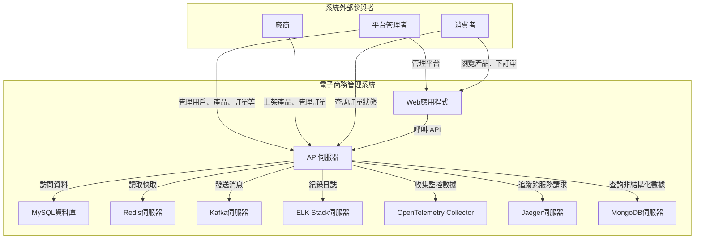

下圖將每個業務模組和其服務、數據庫做了細分，並顯示了模組之間的關聯。這裡假設每個模組都有對應的服務來處理業務邏輯，並且每個模組的資料存儲獨立於其他模組。

```mermaid
graph TD
    A[平台管理者] --> B[用戶管理模組]
    A --> C[產品管理模組]
    A --> D[購物車管理模組]
    A --> E[訂單管理模組]
    A --> F[庫存管理模組]
    A --> G[採購管理模組]
    A --> H[促銷與優惠管理模組]
    A --> I[財務模組]
    A --> J[報表模組]
    A --> K[內容管理模組]
    A --> L[系統設置模組]
    A --> M[日誌與監控模組]
    A --> N[RBAC 權限管理模組]

    B --> O[用戶資料表]
    C --> P[產品資料表]
    D --> Q[購物車資料表]
    E --> R[訂單資料表]
    F --> S[庫存資料表]
    G --> T[採購資料表]
    H --> U[促銷活動資料表]
    I --> V[財務資料表]
    J --> W[報表資料表]
    K --> X[內容資料表]
    L --> Y[配置資料表]
    M --> Z[日誌資料表]
    N --> AA[角色資料表]
    N --> AB[權限資料表]

    B --> AC[用戶驗證與授權服務]
    C --> AD[產品資料管理服務]
    D --> AE[購物車服務]
    E --> AF[訂單處理服務]
    F --> AG[庫存更新服務]
    G --> AH[採購訂單管理服務]
    H --> AI[促銷活動設計服務]
    I --> AJ[交易處理服務]
    J --> AK[報表生成服務]
    K --> AL[文章與頁面管理服務]
    L --> AM[系統配置服務]
    M --> AN[系統監控服務]
    N --> AO[角色與權限分配服務]

    subgraph 廠商
        F
        G
        S
        T
    end

    subgraph 消費者
        E
        D
        R
        Q
    end

    %% 同一個資料庫
    subgraph MySQL資料庫
        O
        P
        Q
        R
        S
        T
        U
        V
        W
        X
        Y
        Z
        AA
        AB
    end
```

## 容器（Container）

### 系統容器

- **Web 應用伺服器**：
  - 使用 React 框架搭配 MUI 進行前端開發。
  - 提供響應式布局（基於 MUI Grid 系統）和現代化界面設計。
- **API 伺服器**：
  - 提供後端 API 服務，處理業務邏輯。
  - 支持多種功能模塊，如用戶、產品、訂單等。
- **MySQL 資料庫伺服器**：
  - 儲存結構化數據，如用戶信息、產品信息等。
- **Redis 伺服器**：
  - 提供緩存加速功能，提高讀取性能。
- **Kafka 伺服器**：
  - 處理異步任務，如報表生成、通知推送等。
- **MongoDB 伺服器**：
  - 儲存延伸資料，如行銷用途的非結構化數據。
- **OpenTelemetry Collector**：
  - 收集遙測數據，用於性能監控和診斷。
- **Jaeger 伺服器**：
  - 可視化追蹤數據，幫助分析跨服務請求流轉。
- **ELK Stack 伺服器**：
  - 負責日誌收集、儲存和可視化。

#### 容器圖

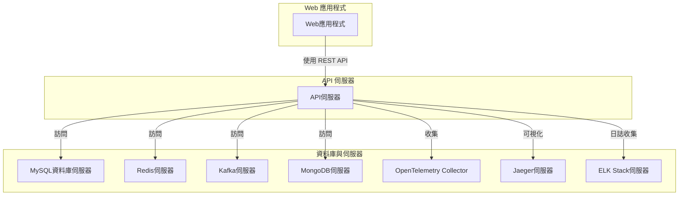

## 組件（Component）

### 用戶管理模組

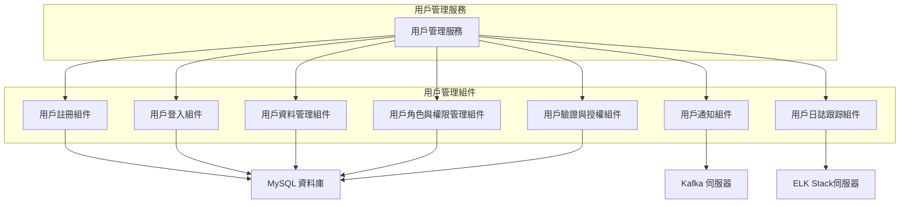

#### 組件說明：

- **用戶註冊組件**：\
   負責處理用戶的註冊邏輯，包括表單驗證、用戶資料儲存等。
- **用戶登入組件**：\
  處理用戶的登入邏輯，負責使用帳號和密碼進行身份驗證。
- **用戶資料管理組件**：\
  負責管理用戶資料，如更新個人資訊、密碼更改等。
- **用戶角色與權限管理組件**：\
  負責分配用戶角色並管理其權限，確保正確的用戶擁有適當的存取權限。
- **用戶驗證與授權組件**：\
  負責用戶身份的驗證與授權，確保用戶在登入後能夠進行正確的操作。
- **用戶通知組件**：\
  負責通知用戶如帳號變更、密碼重置等消息，通常使用消息系統如 Kafka 發送通知。
- **用戶日誌跟踪組件**：\
  用來追蹤和記錄用戶活動，便於審計和故障排查，並將日誌資料發送到 ELK Stack 進行可視化和分析。

#### 外部資源：

- **MySQL 資料庫**：\
  用於儲存用戶的基本資料、角色與權限資訊等。
- **Kafka 伺服器**：\
  用於發送與用戶通知相關的訊息，如帳號註冊成功或密碼重置等。
- **ELK Stack 伺服器**：\
  用於儲存並可視化用戶活動的日誌數據，以便分析和問題診斷。

### 權限管理模組

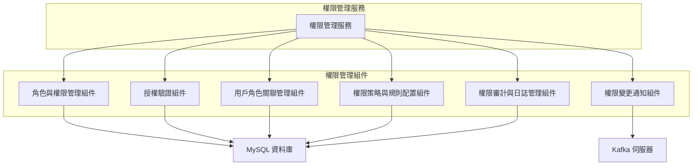

#### 組件說明：

- **角色與權限管理組件**：\
  負責定義和管理系統中不同的角色及其對應的權限。例如，系統管理員、普通用戶等角色，並為每個角色分配不同的操作權限。
- **授權驗證組件**：\
  負責在用戶請求訪問資源時進行授權驗證，確認用戶是否有足夠的權限執行特定操作。
- **用戶角色關聯管理組件**：\
  管理用戶與角色之間的關聯，將特定的角色分配給用戶，確保用戶能夠根據其角色執行相應的操作。
- **權限策略與規則配置組件**：\
  用於配置細化的權限策略與規則，確保每個角色的權限範圍清晰明確，例如角色的權限是基於某些特定條件或行為來設定的。
- **權限審計與日誌管理組件**：\
  負責記錄與監控所有權限相關的操作，並提供審計能力。這有助於追蹤和回顧每個用戶和角色的權限變更。
- **權限變更通知組件**：\
  負責通知相關人員或系統其他部分當權限變更時發生的事件。通常會與 Kafka 伺服器交互以進行異步通知。

#### 外部資源：

- **MySQL 資料庫**：\
  用於儲存角色、權限、用戶角色關聯、權限策略和規則等資料。
- **Kafka 伺服器**：\
  用於處理權限變更事件的通知，例如角色變更或權限更新等。

### 產品管理模組

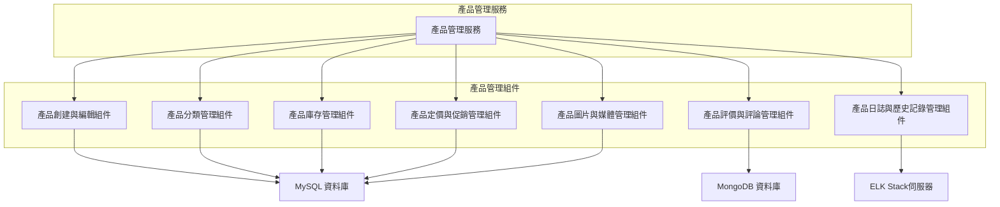

#### 組件說明：

- **產品創建與編輯組件**：\
  負責處理產品的創建與編輯流程，允許管理員輸入產品的基本資訊，如名稱、描述、價格等，並儲存到資料庫。
- **產品分類管理組件**：\
  負責管理產品的分類，包括創建新的分類、編輯現有分類、以及將產品分類到對應的類別中。
- **產品庫存管理組件**：\
  處理產品庫存的管理，當庫存有變動時，會更新庫存數量，並監控庫存狀況。
- **產品定價與促銷管理組件**：\
  負責管理產品的定價策略、折扣與促銷活動，並將其應用於具體的產品。
- **產品圖片與媒體管理組件**：\
  管理產品的圖片和其他多媒體資料，如圖片上傳、編輯、刪除等，並儲存相關的媒體文件。
- **產品評價與評論管理組件**：\
  處理用戶對產品的評價與評論，收集並儲存來自顧客的反饋，並將其顯示在產品頁面上。
- **產品日誌與歷史記錄管理組件**：\
  跟蹤所有產品的變更歷史，如價格變動、庫存變更等，並將這些日誌資料發送到 ELK Stack 進行可視化和分析。

#### 外部資源：

- **MySQL 資料庫**：\
  用於儲存產品的基本資料（如名稱、描述、價格、庫存量等）、分類資料等。
- **MongoDB 資料庫**：\
  用於儲存產品的評價與評論等非結構化資料。
- **ELK Stack 伺服器**：\
  用於記錄和分析產品相關的日誌與變更記錄，幫助進行故障排查與性能監控。

### 購物車管理模組

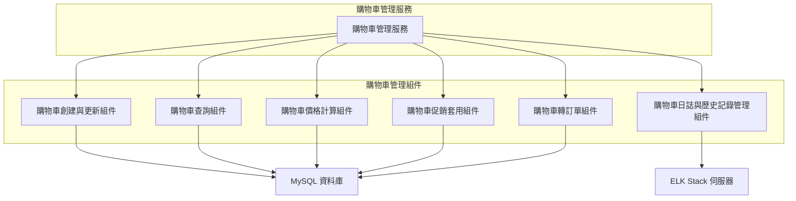

#### 組件說明

- **購物車創建與更新組件**：  
  負責用戶在前端新增、修改或刪除購物車項目。此組件與 MySQL 資料庫進行交互，將每個購物車項目的詳細資料（如 SKU、數量、添加時間等）持久化儲存。

- **購物車查詢組件**：  
  提供介面以供前端或管理端查詢特定用戶的購物車內容。這裡可以提供購物車內所有項目的清單、總金額等資料，協助顧客或客服了解目前的購物車狀態。

- **購物車價格計算組件**：  
  針對購物車內所有項目進行價格計算，包括商品原價、數量、以及可能的動態調整（例如匯率轉換或會員折扣），確保前端顯示正確的價格信息。

- **購物車促銷套用組件**：  
  負責將促銷與優惠活動應用至購物車中的商品，如折扣碼、滿額優惠、限時折扣等。該組件通常會與促銷管理模組或優惠服務進行整合，動態計算優惠後價格。

- **購物車轉訂單組件**：  
  當用戶決定結帳時，將購物車內容轉換成訂單（Order），並在轉換過程中應用最新的價格、庫存檢查等邏輯，確保生成的訂單數據正確且符合下單標準。

- **購物車日誌與歷史記錄管理組件**：  
  用於記錄購物車內的各項操作歷程（新增、修改、移除），以便未來對使用者行為進行審計和統計分析。這些日誌資料會發送到 ELK Stack 伺服器進行集中儲存與可視化。

#### 外部資源說明

- **MySQL 資料庫**：  
  負責儲存所有購物車項目和相關狀態資料。購物車創建、更新、查詢和轉訂單等操作均依賴此資料庫中的購物車資料表。
- **ELK Stack 伺服器**：  
  用於收集與分析購物車操作過程中的日誌和歷史記錄，便於系統監控及故障排查。

### 訂單管理模組

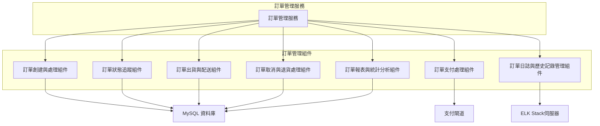

#### 組件說明：

- **訂單創建與處理組件**：\
  負責創建新的訂單並處理訂單流程，如填寫訂單基本資料、選擇產品、計算價格等。此組件與資料庫交互，將訂單詳細資料儲存。
- **訂單支付處理組件**：\
  負責處理訂單的支付流程，與外部支付閘道（如信用卡、PayPal 等）進行整合，確保訂單能夠成功支付並更新支付狀態。
- **訂單狀態追蹤組件**：\
  負責追蹤訂單的各種狀態，如待處理、已付款、已出貨等。當狀態變更時，會更新資料庫並通知相關系統。
- **訂單出貨與配送組件**：\
  負責處理訂單的出貨與配送，協調倉庫和物流公司將商品配送給顧客。會與資料庫互動，更新出貨狀態。
- **訂單取消與退貨處理組件**：\
  負責處理訂單的取消與退貨流程。當顧客要求退貨或取消訂單時，會進行必要的處理並更新訂單狀態。
- **訂單日誌與歷史記錄管理組件**：\
  負責記錄訂單的所有操作與變更，如支付、出貨、退貨等。這些日誌資料會發送到 ELK Stack 進行可視化和分析。
- **訂單報表與統計分析組件**：\
  負責生成各類訂單報表，如銷售報表、退款報表等，並提供分析功能，幫助管理層了解業務運營狀況。

#### 外部資源：

- **MySQL 資料庫**：\
  用於儲存訂單的基本資料、支付狀態、出貨狀態等。
- **支付閘道**：\
  負責處理訂單的支付交易，與各種支付方式進行整合。
- **ELK Stack 伺服器**：\
  用於記錄和分析訂單相關的日誌與變更記錄，幫助進行故障排查與性能監控。

### 庫存管理模組

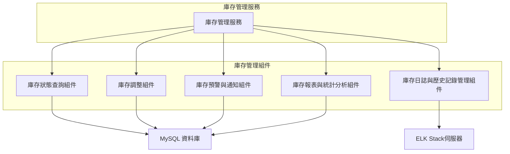

#### 組件說明：

- **庫存狀態查詢組件**：\
  負責查詢目前庫存的狀態，如庫存數量、產品信息等。會從資料庫中檢索庫存資料，並提供即時查詢功能。
- **庫存調整組件**：\
  負責處理庫存的增減，這包括手動調整庫存數量（如損壞、退貨等情況）以及自動調整（如出貨、採購入庫等情況）。會根據業務需求來調整庫存並更新資料庫。
- **庫存預警與通知組件**：\
  負責監控庫存狀態，當庫存數量低於設定的閾值時，會觸發警報並發送通知（如電子郵件或消息推送）給管理員或相關部門。
- **庫存報表與統計分析組件**：\
  負責生成庫存相關的報表，如庫存周轉率、缺貨報表、庫存結存報表等。這些報表有助於管理員做出補貨或調整庫存策略的決策。
- **庫存日誌與歷史記錄管理組件**：\
  負責記錄所有庫存操作的詳細信息（如庫存調整、警報觸發等），並將這些日誌資料發送到 ELK Stack 伺服器進行可視化分析和監控。

#### 外部資源：

- **MySQL 資料庫**：\
  用於儲存庫存的基本資料，如產品庫存數量、庫存入庫/出庫記錄等。
- **ELK Stack 伺服器**：\
  用於記錄庫存操作的日誌，並進行日誌的可視化與分析，幫助快速識別庫存異常和趨勢。

### 採購管理模組

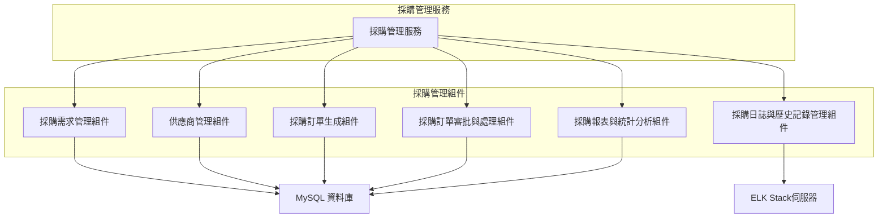

#### 組件說明：

- **採購需求管理組件**：\
  負責管理採購需求的創建與追蹤，將各部門的需求匯總成採購清單，並根據需求進行管理。此組件會連接到資料庫以存儲需求相關的數據。
- **供應商管理組件**：\
  負責管理供應商的基本信息（如名稱、聯繫方式、信用評級等），並跟蹤與各個供應商的合作狀況。它還能根據供應商的表現對其進行評估。
- **採購訂單生成組件**：\
  根據需求與供應商的信息，自動生成採購訂單，並進行相關處理。該組件需要連接到資料庫來管理所有訂單數據。
- **採購訂單審批與處理組件**：\
  負責審批與處理採購訂單，包括對訂單的驗證、審批流程和付款處理等。該組件確保所有採購訂單都經過適當的審核流程。
- **採購報表與統計分析組件**：\
  生成採購相關的報表，如供應商績效報表、採購支出報告等。這些報表有助於管理層作出更加明智的採購決策。
- **採購日誌與歷史記錄管理組件**：\
  負責記錄所有採購操作的詳細信息，並將這些日誌資料發送到 ELK Stack 伺服器進行可視化分析，幫助監控採購活動和識別潛在問題。

#### 外部資源：

- **MySQL 資料庫**：\
  用於儲存與採購管理相關的數據，如採購需求、供應商資料、訂單等。
- **ELK Stack 伺服器**：\
  用於記錄採購管理操作的日誌，並進行日誌的可視化與分析，幫助及時發現異常和改進流程。

### 促銷與優惠管理模組

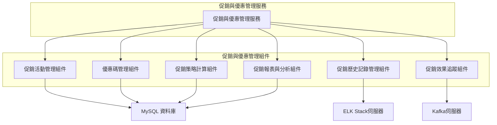

#### 組件說明：

- **促銷活動管理組件**：\
  負責創建、管理和推廣促銷活動。這些活動可以是限時折扣、打折優惠等。此組件會與資料庫進行交互來儲存和更新促銷活動的資料。
- **優惠碼管理組件**：\
  負責生成和管理優惠碼。它可以處理優惠碼的有效性、過期時間以及是否已經使用過。該組件會和資料庫中的優惠碼表進行互動。
- **促銷策略計算組件**：\
  負責根據商店的規則和用戶的行為自動計算促銷優惠的適用情況，例如折扣計算、滿額優惠等。此組件可以根據交易情況來調整促銷策略。
- **促銷報表與分析組件**：\
  生成促銷活動的報表，進行促銷效果的分析，幫助管理者評估每個活動的成功率、銷售增長等指標。該組件將促銷數據從資料庫中提取並進行處理。
- **促銷歷史記錄管理組件**：\
  記錄每一個促銷活動的歷史數據，並將其發送至 ELK Stack 伺服器進行存儲和可視化分析。這有助於未來的促銷活動規劃和決策。
- **促銷效果追蹤組件**：\
  這個組件負責追蹤促銷活動的實時效果，並將這些效果數據發送至 Kafka 伺服器，進行即時處理和後續的數據分析。

#### 外部資源：

- **MySQL 資料庫**：\
  用於儲存促銷活動、優惠碼和促銷策略的數據。
- **ELK Stack 伺服器**：\
  負責儲存和可視化促銷歷史記錄和日誌，幫助監控促銷活動的效果。
- **Kafka 伺服器**：\
  用於即時處理促銷效果的數據流，將促銷的反應和效果追蹤數據傳送至後端系統進行即時處理。

### 財務模組

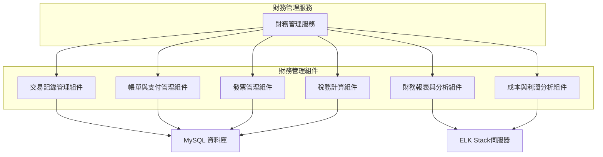

#### 組件說明：

- **交易記錄管理組件**：\
  負責儲存和處理所有的交易記錄，包括訂單付款、退款等。該組件會從資料庫中提取交易資料並進行處理，確保每筆交易記錄都準確無誤。
- **帳單與支付管理組件**：\
  管理用戶的帳單和支付信息，包括付款方式、付款狀態等。此組件會與支付系統進行交互，並將交易的支付狀態更新至資料庫。
- **發票管理組件**：\
  負責生成和管理發票。它能夠根據交易記錄和用戶需求生成發票，並將發票數據儲存在資料庫中。
- **稅務計算組件**：\
  根據當前的稅法和交易金額計算所需的稅額。此組件會根據每筆交易的金額、地點等資訊來動態計算應繳稅額。
- **財務報表與分析組件**：\
  負責生成財務報表，並根據財務數據進行分析，如月度營收報表、利潤報表等。此組件將資料庫中的財務數據提取並生成報表。
- **成本與利潤分析組件**：\
  分析公司的成本結構和利潤來源。這有助於決策者理解公司各項業務的利潤情況，並對未來的財務狀況作出預測。

#### 外部資源：

- **MySQL 資料庫**：\
  用於儲存交易記錄、帳單、發票、稅務計算等財務數據。
- **ELK Stack 伺服器**：\
  負責儲存和可視化財務報表及成本分析結果，幫助財務團隊實時監控財務狀況。

### 報表模組

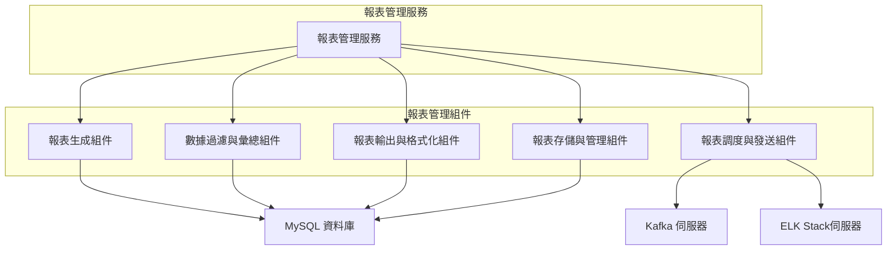

#### 組件說明：

- **報表生成組件**：\
  負責從不同資料源中提取數據，並根據用戶需求生成報表。這些報表可能是財務報表、銷售報表、庫存報表等。
- **數據過濾與彙總組件**：\
  此組件對報表所需的數據進行過濾、彙總和計算，以確保報表所顯示的數據正確無誤，並符合用戶需求。
- **報表輸出與格式化組件**：\
  將生成的報表數據轉換為不同格式（如 PDF、Excel、CSV 等），並根據設計模板進行格式化輸出。
- **報表存儲與管理組件**：\
  負責存儲已生成的報表，並允許用戶對報表進行檢索和管理。報表的存儲方式可以是關聯式資料庫（如 MySQL）或 NoSQL 資料庫（如 MongoDB）。
- **報表調度與發送組件**：\
  根據設置的排程，自動生成並發送報表到指定的用戶或系統。它可能會利用 Kafka 伺服器來處理報表生成和發送的任務隊列，並通過 ELK Stack 進行日誌記錄與監控。

#### 外部資源：

- **MySQL 資料庫**：\
  用於儲存和檢索報表生成所需的結構化數據。
- **MongoDB 資料庫**：\
  儲存部分報表生成過程中的非結構化數據（如文件存儲）。
- **Kafka 伺服器**：\
  負責處理異步報表生成和發送的隊列，確保報表發送過程不會阻塞主流程。
- **ELK Stack 伺服器**：\
  負責日誌收集和分析，並監控報表生成與發送過程中的各種事件。

### 內容管理模組

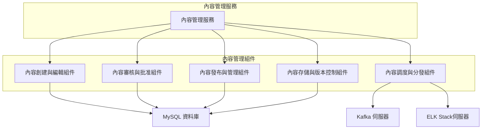

#### 組件說明：

- **內容創建與編輯組件**：\
  用戶或內容創作者通過此組件創建和編輯內容。內容可以是文字、圖片、影片等多種格式，並且可以進行編輯和草稿保存。
- **內容審核與批准組件**：\
  內容創建完成後，會進行審核和批准。這個組件負責檢查內容的合法性、質量和符合公司政策的標準，並給予審核結果。
- **內容發布與管理組件**：\
  此組件負責將審核通過的內容發布到網站、應用或其他平台上，並對已發布的內容進行管理（如更新、下架等）。
- **內容存儲與版本控制組件**：\
  內容在存儲過程中會進行版本控制，這樣可以追蹤和恢復歷史版本，並且保存不同版本的內容資料。
- **內容調度與分發組件**：\
  此組件負責根據調度規則自動發布內容，並將內容分發到不同的渠道或平台，如社交媒體、電子郵件、網頁等。

#### 外部資源：

- **MySQL 資料庫**：\
  用於儲存結構化的內容數據，例如內容的標題、描述、分類等。
- **MongoDB 資料庫**：\
  存儲內容的非結構化資料，如圖片、影片等媒體檔案。
- **Kafka 伺服器**：\
  處理異步的內容分發隊列，確保內容可以根據預定的時間和目標自動發送。
- **ELK Stack 伺服器**：\
  負責收集、儲存和可視化內容管理系統的日誌數據，並提供監控和問題排查功能。

### 系統設置模組

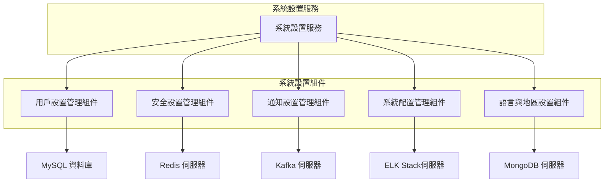

#### 組件說明：

- **用戶設置管理組件**：\
  負責管理用戶的偏好設置和個性化選項，像是通知偏好、界面設置等。這些設置可以與用戶的賬戶資料結合來提供個性化的體驗。
- **安全設置管理組件**：\
  處理與系統安全相關的設置，如密碼策略、身份驗證方式、多因素身份驗證（MFA）設置等。
- **通知設置管理組件**：\
  負責管理用戶的通知設置，包括如何接收通知、通知的頻率、通知渠道（電子郵件、SMS、推送等）等。
- **系統配置管理組件**：\
  該組件負責管理全局的系統配置，如時區、資料庫連接設置、API 密鑰等。這些設置對整個應用的運行至關重要。
- **語言與地區設置組件**：\
  負責管理系統的語言與地區設置，包括支持的語言、貨幣、日期時間格式等，這有助於本地化支持。

#### 外部資源：

- **MySQL 資料庫**：\
  儲存系統設置的元數據，例如用戶偏好、設置歷史等。
- **Redis 伺服器**：\
  用於快速緩存與存取某些系統設置，尤其是安全相關設置或需要頻繁訪問的設置。
- **Kafka 伺服器**：\
  處理通知設置的事件傳遞，實現異步通知。
- **ELK Stack 伺服器**：\
  收集並分析系統設置變更的日誌，提供設定更改的追蹤功能。
- **MongoDB 伺服器**：\
  儲存和管理與語言、地區相關的設置與資料，如多語言支持、國際化設置等。

### 日誌與監控模組

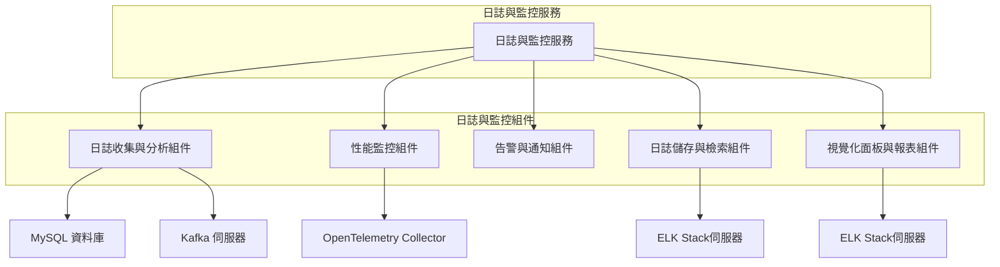

#### 組件說明：

- **日誌收集與分析組件**：\
  負責收集應用和系統的日誌數據，並進行初步分析，篩選出有價值的日誌信息。這些日誌數據可能來自不同的應用服務、API、數據庫等。
- **性能監控組件**：\
  用來監控應用程序、系統及服務的性能指標，例如 CPU 使用率、內存使用、請求處理時間等，並將這些指標發送到集中式監控系統。
- **告警與通知組件**：\
  當監控系統發現異常或性能指標超出預設範圍時，該組件負責觸發告警並通報相關人員。告警可以透過電子郵件、Slack、SMS 等方式發送。
- **日誌儲存與檢索組件**：\
  負責將收集到的日誌數據儲存到長期存儲中，並提供檢索功能。使用者可以根據日期、關鍵字等條件進行日誌查詢。
- **視覺化面板與報表組件**：\
  負責將日誌數據和性能監控指標可視化，並生成實時的報表與圖表，幫助管理人員和開發人員分析系統狀態。

#### 外部資源：

- **MySQL 資料庫**：\
  儲存監控系統的元數據，如警報設置、歷史數據等。
- **Kafka 伺服器**：\
  用於傳遞日誌數據和性能監控指標，實現異步處理。
- **ELK Stack 伺服器**：\
  用於集中儲存日誌數據，並支持進行日誌檢索與分析。
- **OpenTelemetry Collector**：\
  收集應用和基礎設施的遙測數據（例如分佈式追蹤、指標等），並將其傳送至後端系統進行分析。

## 代碼（Code）

這個層次主要關注的是如何實現特定的功能或組件
(略)

## 未來擴展到微服務架構

隨著系統資料和使用者數量的增加，為了應對日益複雜的業務需求和提高系統的可擴展性，未來可以將各個模組拆分成獨立的微服務。\
每個微服務將負責一個特定的業務邏輯，並通過 API 進行通信。這樣不僅能夠提高系統的可擴展性和容錯性，也能夠更好地適應未來的業務變化和使用情境的需求。

#### 微服務架構圖

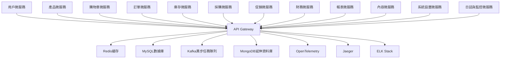
