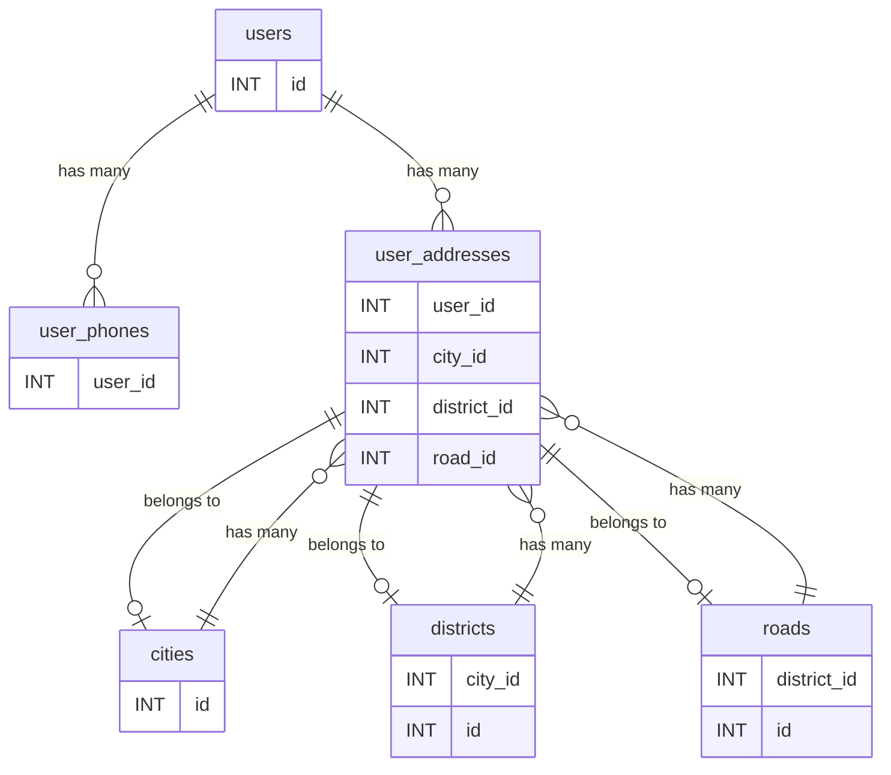
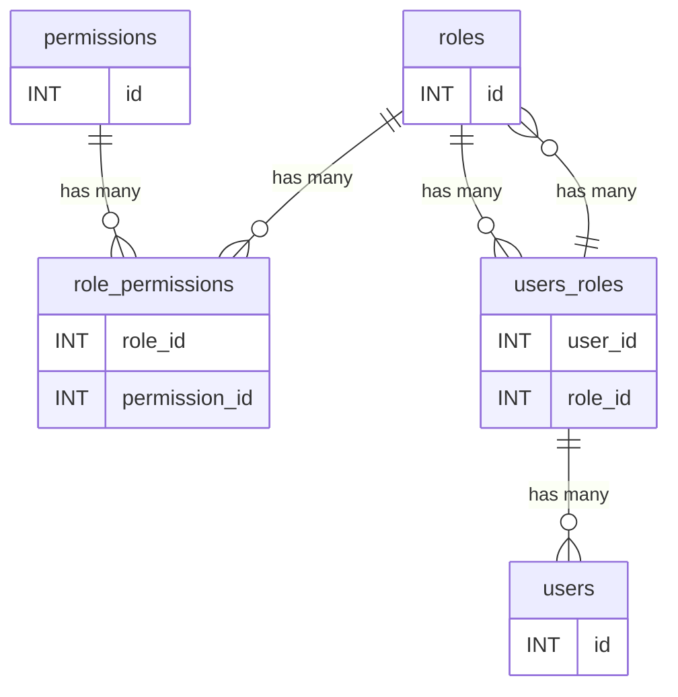
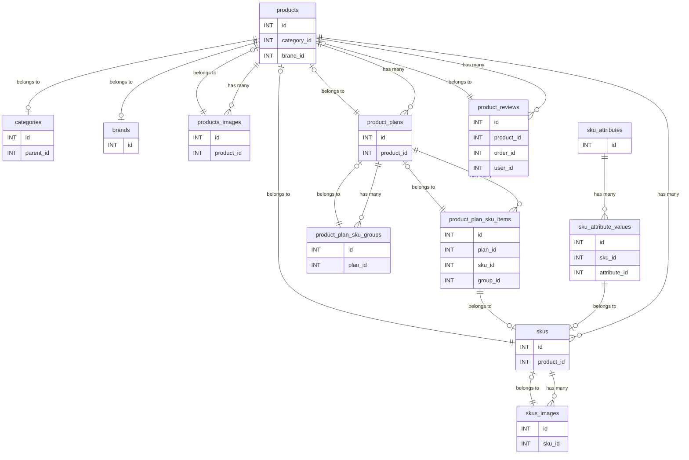
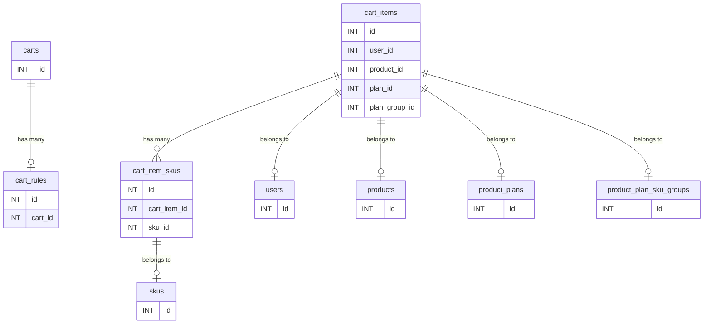
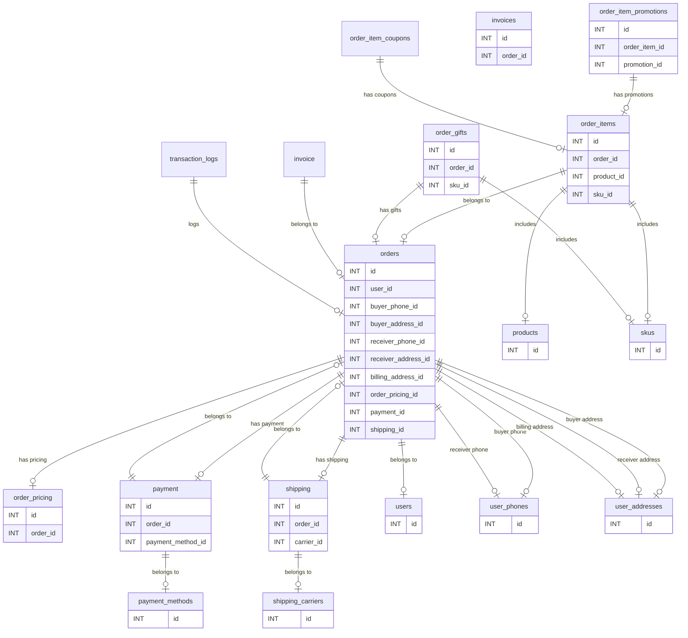
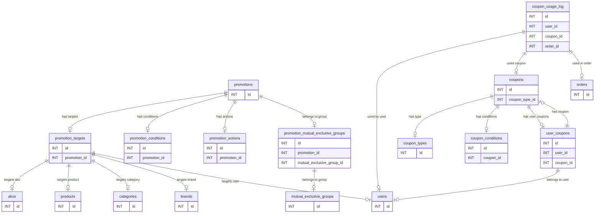
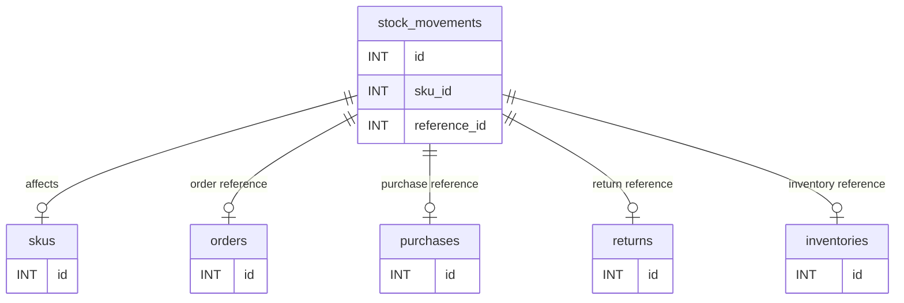
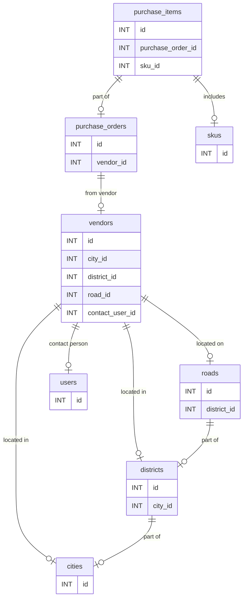
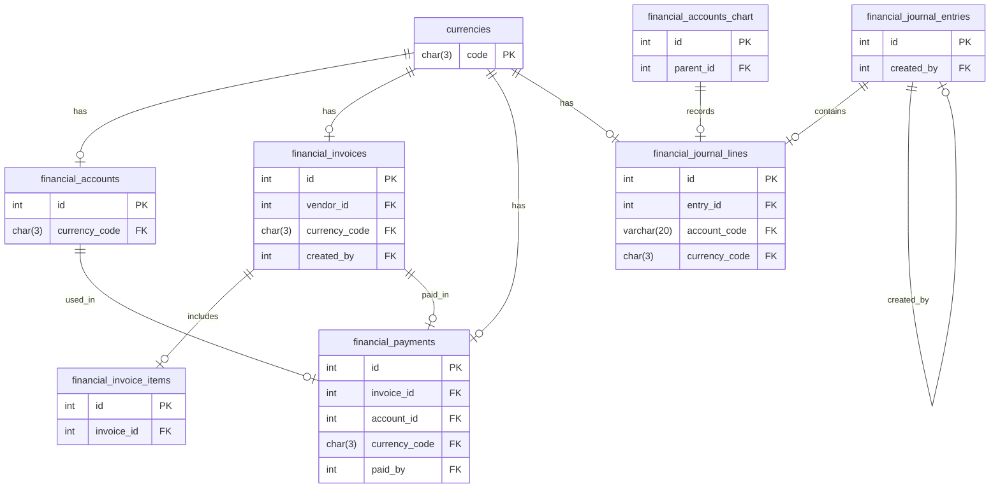
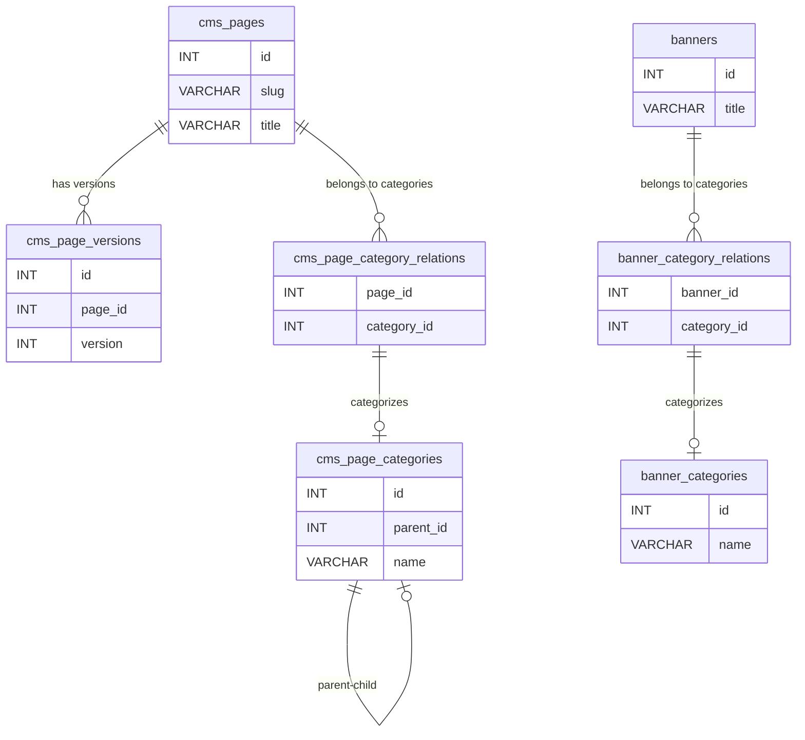

# 依模組整理 ER Diagram 和 Table Schema

## 🧑‍💼 用戶管理模組

### ER Diagram



### Table Schema

```sql
-- 用戶主表
CREATE TABLE users (
    id INT UNSIGNED PRIMARY KEY AUTO_INCREMENT,
    name VARCHAR(255) NOT NULL COMMENT '用戶名稱',
    email VARCHAR(255) UNIQUE NOT NULL COMMENT '電子信箱',
    password VARCHAR(255) NOT NULL COMMENT '加密後密碼',
    status ENUM('active', 'inactive', 'banned') DEFAULT 'active' COMMENT '用戶狀態',
    oidc_enabled BOOLEAN DEFAULT FALSE COMMENT '是否啟用 OIDC 登入(擴展模組Casdoor)',
    created_at DATETIME DEFAULT CURRENT_TIMESTAMP COMMENT '建立時間',
    updated_at DATETIME DEFAULT CURRENT_TIMESTAMP ON UPDATE CURRENT_TIMESTAMP COMMENT '更新時間'
    UNIQUE KEY uq_users_email (email)
    INDEX idx_users_status (status)
) ENGINE=InnoDB DEFAULT CHARSET=utf8mb4 COLLATE=utf8mb4_unicode_ci COMMENT='用戶主表';

-- 用戶電話簿
CREATE TABLE user_phones (
    id INT UNSIGNED PRIMARY KEY AUTO_INCREMENT,
    user_id INT UNSIGNED NOT NULL COMMENT '用戶 ID',
    name VARCHAR(255) NOT NULL COMMENT '電話名稱',
    encrypted_phone VARBINARY(255) NOT NULL COMMENT 'AES 加密後的電話',
    hashed_phone CHAR(64) NOT NULL COMMENT 'SHA256 雜湊，用於查找',
    is_default BOOLEAN DEFAULT FALSE COMMENT '是否為預設電話',
    created_at DATETIME DEFAULT CURRENT_TIMESTAMP COMMENT '建立時間',
    updated_at DATETIME DEFAULT CURRENT_TIMESTAMP ON UPDATE CURRENT_TIMESTAMP COMMENT '更新時間',
    UNIQUE (user_id, is_default) COMMENT '每個用戶只能有一個預設電話'
) ENGINE=InnoDB DEFAULT CHARSET=utf8mb4 COLLATE=utf8mb4_unicode_ci COMMENT='用戶電話簿';

-- 用戶地址簿
CREATE TABLE user_addresses (
    id INT UNSIGNED PRIMARY KEY AUTO_INCREMENT,
    user_id INT UNSIGNED NOT NULL COMMENT '用戶 ID',
    recipient_name VARCHAR(255) COMMENT '收件人姓名',
    city_id INT UNSIGNED COMMENT '縣市 ID',
    district_id INT UNSIGNED COMMENT '區域 ID',
    road_id INT UNSIGNED COMMENT '路名 ID',
    postal_code VARCHAR(20) COMMENT '郵遞區號',
    encrypted_address VARBINARY(512) NOT NULL COMMENT 'AES 加密後的地址',
    is_default BOOLEAN DEFAULT FALSE COMMENT '是否為預設地址',
    created_at DATETIME DEFAULT CURRENT_TIMESTAMP COMMENT '建立時間',
    updated_at DATETIME DEFAULT CURRENT_TIMESTAMP ON UPDATE CURRENT_TIMESTAMP COMMENT '更新時間'
    UNIQUE (user_id, is_default) COMMENT '每個用戶只能有一個預設地址'
) ENGINE=InnoDB DEFAULT CHARSET=utf8mb4 COLLATE=utf8mb4_unicode_ci COMMENT='用戶地址簿';

-- 地址的縣市表
CREATE TABLE cities (
    id INT UNSIGNED PRIMARY KEY AUTO_INCREMENT,
    name VARCHAR(255) NOT NULL COMMENT '縣市名稱',
    created_at DATETIME DEFAULT CURRENT_TIMESTAMP COMMENT '建立時間',
    updated_at DATETIME DEFAULT CURRENT_TIMESTAMP ON UPDATE CURRENT_TIMESTAMP COMMENT '更新時間',
    INDEX idx_cities_name (name)
) ENGINE=InnoDB DEFAULT CHARSET=utf8mb4 COLLATE=utf8mb4_unicode_ci COMMENT='縣市表';

-- 地址的區域表
CREATE TABLE districts (
    id INT UNSIGNED PRIMARY KEY AUTO_INCREMENT,
    city_id INT UNSIGNED NOT NULL COMMENT '縣市 ID',
    name VARCHAR(255) NOT NULL COMMENT '區域名稱',
    created_at DATETIME DEFAULT CURRENT_TIMESTAMP COMMENT '建立時間',
    updated_at DATETIME DEFAULT CURRENT_TIMESTAMP ON UPDATE CURRENT_TIMESTAMP COMMENT '更新時間'
) ENGINE=InnoDB DEFAULT CHARSET=utf8mb4 COLLATE=utf8mb4_unicode_ci COMMENT='區域表';

-- 地址的路名表
CREATE TABLE roads (
    id INT UNSIGNED PRIMARY KEY AUTO_INCREMENT,
    district_id INT UNSIGNED COMMENT '區域 ID',
    name VARCHAR(255) NOT NULL COMMENT '路名名稱',
    created_at DATETIME DEFAULT CURRENT_TIMESTAMP COMMENT '建立時間',
    updated_at DATETIME DEFAULT CURRENT_TIMESTAMP ON UPDATE CURRENT_TIMESTAMP COMMENT '更新時間'
) ENGINE=InnoDB DEFAULT CHARSET=utf8mb4 COLLATE=utf8mb4_unicode_ci COMMENT='路名表';

```

## 🔐 RBAC 權限管理模組

### ER Diagram



### Table Schema

```sql
-- 角色主表
CREATE TABLE roles (
    id INT UNSIGNED PRIMARY KEY AUTO_INCREMENT,
    name VARCHAR(255) NOT NULL COMMENT '角色名稱',
    created_at DATETIME DEFAULT CURRENT_TIMESTAMP COMMENT '建立時間',
    updated_at DATETIME DEFAULT CURRENT_TIMESTAMP ON UPDATE CURRENT_TIMESTAMP COMMENT '更新時間'
) ENGINE=InnoDB DEFAULT CHARSET=utf8mb4 COLLATE=utf8mb4_unicode_ci COMMENT='角色主表';

-- 權限主表
CREATE TABLE permissions (
    id INT UNSIGNED PRIMARY KEY AUTO_INCREMENT,
    name VARCHAR(255) NOT NULL COMMENT '權限名稱',
    description VARCHAR(255) COMMENT '權限描述',
    created_at DATETIME DEFAULT CURRENT_TIMESTAMP COMMENT '建立時間',
    updated_at DATETIME DEFAULT CURRENT_TIMESTAMP ON UPDATE CURRENT_TIMESTAMP COMMENT '更新時間'
) ENGINE=InnoDB DEFAULT CHARSET=utf8mb4 COLLATE=utf8mb4_unicode_ci COMMENT='權限主表';

-- 角色與權限關聯表
CREATE TABLE role_permissions (
    id INT UNSIGNED PRIMARY KEY AUTO_INCREMENT,
    role_id INT UNSIGNED NOT NULL COMMENT '角色 ID',
    permission_id INT UNSIGNED NOT NULL COMMENT '權限 ID',
    created_at DATETIME DEFAULT CURRENT_TIMESTAMP COMMENT '建立時間',
    updated_at DATETIME DEFAULT CURRENT_TIMESTAMP ON UPDATE CURRENT_TIMESTAMP COMMENT '更新時間'
) ENGINE=InnoDB DEFAULT CHARSET=utf8mb4 COLLATE=utf8mb4_unicode_ci COMMENT='角色與權限關聯表';

-- 用戶與角色關聯表
CREATE TABLE users_roles (
    id INT UNSIGNED PRIMARY KEY AUTO_INCREMENT,
    user_id INT UNSIGNED NOT NULL COMMENT '用戶 ID',
    role_id INT UNSIGNED NOT NULL COMMENT '角色 ID',
    created_at DATETIME DEFAULT CURRENT_TIMESTAMP COMMENT '建立時間',
    updated_at DATETIME DEFAULT CURRENT_TIMESTAMP ON UPDATE CURRENT_TIMESTAMP COMMENT '更新時間'
) ENGINE=InnoDB DEFAULT CHARSET=utf8mb4 COLLATE=utf8mb4_unicode_ci COMMENT='用戶與角色關聯表';
```

## 📦 產品管理模組

### ER Diagram



### Table Schema

```sql
-- 商品分類支援多層級
CREATE TABLE categories (
    id INT UNSIGNED PRIMARY KEY AUTO_INCREMENT,
    name VARCHAR(255) NOT NULL COMMENT '分類名稱',
    parent_id INT UNSIGNED COMMENT '上層分類 ID',
    layer INT UNSIGNED DEFAULT 0 COMMENT '層級',
    sort_order INT DEFAULT 0 COMMENT '排序權重'
) ENGINE=InnoDB DEFAULT CHARSET=utf8mb4 COLLATE=utf8mb4_unicode_ci COMMENT='商品分類';

-- 品牌資訊
CREATE TABLE brands (
    id INT UNSIGNED PRIMARY KEY AUTO_INCREMENT,
    name VARCHAR(255) NOT NULL COMMENT '品牌名稱',
    description TEXT COMMENT '品牌描述',
    logo_url VARCHAR(255) COMMENT '品牌 Logo 圖片網址'
) ENGINE=InnoDB DEFAULT CHARSET=utf8mb4 COLLATE=utf8mb4_unicode_ci COMMENT='品牌資訊';

-- 商品主表SPU
CREATE TABLE products (
    id INT UNSIGNED PRIMARY KEY AUTO_INCREMENT,
    name VARCHAR(255) NOT NULL COMMENT '商品名稱',
    description TEXT COMMENT '商品描述',
    category_id INT UNSIGNED COMMENT '分類 ID',
    brand_id INT UNSIGNED COMMENT '品牌 ID',
    is_active BOOLEAN DEFAULT TRUE COMMENT '是否上架',
    created_at DATETIME DEFAULT CURRENT_TIMESTAMP COMMENT '建立時間',
    updated_at DATETIME DEFAULT CURRENT_TIMESTAMP ON UPDATE CURRENT_TIMESTAMP COMMENT '更新時間'
) ENGINE=InnoDB DEFAULT CHARSET=utf8mb4 COLLATE=utf8mb4_unicode_ci COMMENT='商品主表';

-- 商品圖片
CREATE TABLE products_images (
    id INT UNSIGNED PRIMARY KEY AUTO_INCREMENT,
    product_id INT UNSIGNED NOT NULL COMMENT '商品 ID',
    image_url VARCHAR(255) NOT NULL COMMENT '圖片網址',
    sort_order INT DEFAULT 0 COMMENT '排序',
    is_active BOOLEAN DEFAULT TRUE COMMENT '是否顯示',
    created_at DATETIME DEFAULT CURRENT_TIMESTAMP COMMENT '建立時間',
    updated_at DATETIME DEFAULT CURRENT_TIMESTAMP ON UPDATE CURRENT_TIMESTAMP COMMENT '更新時間'
) ENGINE=InnoDB DEFAULT CHARSET=utf8mb4 COLLATE=utf8mb4_unicode_ci COMMENT='商品圖片';

-- 商品具體的商品庫存單位SKU
CREATE TABLE skus (
    id INT UNSIGNED PRIMARY KEY AUTO_INCREMENT,
    product_id INT UNSIGNED NOT NULL COMMENT '商品 ID',
    vendor_id INT UNSIGNED NOT NULL COMMENT '廠商 ID',
    sku_code VARCHAR(100) UNIQUE COMMENT 'SKU 編碼',
    price DECIMAL(10,2) NOT NULL COMMENT '售價',
    cost DECIMAL(10,2) COMMENT '成本',
    stock INT UNSIGNED DEFAULT 0 COMMENT '庫存數量',
    is_active BOOLEAN DEFAULT TRUE COMMENT '是否上架'
) ENGINE=InnoDB DEFAULT CHARSET=utf8mb4 COLLATE=utf8mb4_unicode_ci COMMENT='商品 SKU 規格檔';

-- 商品 SKU 圖片
CREATE TABLE skus_images (
    id INT UNSIGNED PRIMARY KEY AUTO_INCREMENT,
    sku_id INT UNSIGNED NOT NULL COMMENT 'SKU ID',
    image_url VARCHAR(255) NOT NULL COMMENT '圖片網址',
    sort_order INT DEFAULT 0 COMMENT '排序',
    is_active BOOLEAN DEFAULT TRUE COMMENT '是否顯示',
    created_at DATETIME DEFAULT CURRENT_TIMESTAMP COMMENT '建立時間',
    updated_at DATETIME DEFAULT CURRENT_TIMESTAMP ON UPDATE CURRENT_TIMESTAMP COMMENT '更新時間'
) ENGINE=InnoDB DEFAULT CHARSET=utf8mb4 COLLATE=utf8mb4_unicode_ci COMMENT='商品 SKU 圖片';

-- 商品屬性定義表
CREATE TABLE sku_attributes (
    id INT UNSIGNED PRIMARY KEY AUTO_INCREMENT,
    name VARCHAR(255) NOT NULL COMMENT '屬性名稱（如顏色、容量）',
    created_at DATETIME DEFAULT CURRENT_TIMESTAMP COMMENT '建立時間',
    updated_at DATETIME DEFAULT CURRENT_TIMESTAMP ON UPDATE CURRENT_TIMESTAMP COMMENT '更新時間'
) ENGINE=InnoDB DEFAULT CHARSET=utf8mb4 COLLATE=utf8mb4_unicode_ci COMMENT='商品 SKU屬性定義表';

-- 商品屬性值表
CREATE TABLE sku_attribute_values (
    id INT UNSIGNED PRIMARY KEY AUTO_INCREMENT,
    sku_id INT UNSIGNED NOT NULL,
    attribute_id INT UNSIGNED NOT NULL,
    value VARCHAR(255) NOT NULL,
    created_at DATETIME DEFAULT CURRENT_TIMESTAMP COMMENT '建立時間',
    updated_at DATETIME DEFAULT CURRENT_TIMESTAMP ON UPDATE CURRENT_TIMESTAMP COMMENT '更新時間',
    INDEX idx_sku_id (sku_id)
) ENGINE=InnoDB DEFAULT CHARSET=utf8mb4 COLLATE=utf8mb4_unicode_ci COMMENT='商品 SKU 屬性值';

-- 商品方案主表
CREATE TABLE product_plans (
    id INT UNSIGNED PRIMARY KEY AUTO_INCREMENT,
    product_id INT UNSIGNED NOT NULL COMMENT '商品 ID',
    name VARCHAR(255) NOT NULL COMMENT '方案名稱（如：家庭包）',
    description TEXT,
    plan_type ENUM('bundle', 'subscription', 'custom') DEFAULT 'bundle',
    price DECIMAL(10,2) COMMENT '方案售價',
    is_active BOOLEAN DEFAULT TRUE,
    created_at DATETIME DEFAULT CURRENT_TIMESTAMP COMMENT '建立時間',
    updated_at DATETIME DEFAULT CURRENT_TIMESTAMP ON UPDATE CURRENT_TIMESTAMP COMMENT '更新時間',
    INDEX idx_product_id (product_id)
) ENGINE=InnoDB DEFAULT CHARSET=utf8mb4 COLLATE=utf8mb4_unicode_ci COMMENT='商品方案主表';

-- 商品方案 SKU 群組表
CREATE TABLE product_plan_sku_groups (
    id INT UNSIGNED PRIMARY KEY AUTO_INCREMENT,
    plan_id INT UNSIGNED NOT NULL COMMENT '所屬方案 ID',
    name VARCHAR(100) NOT NULL COMMENT '群組名稱',
    max_select INT UNSIGNED DEFAULT 1 COMMENT '最多可選幾項',
    allow_duplicate BOOLEAN DEFAULT FALSE COMMENT '是否允許選重複項目',
    display_order INT DEFAULT 0 COMMENT '排序',
    description TEXT COMMENT '描述說明',
    created_at DATETIME DEFAULT CURRENT_TIMESTAMP COMMENT '建立時間',
    updated_at DATETIME DEFAULT CURRENT_TIMESTAMP ON UPDATE CURRENT_TIMESTAMP COMMENT '更新時間',
    INDEX idx_plan_group (plan_id, id)
) ENGINE=InnoDB DEFAULT CHARSET=utf8mb4 COLLATE=utf8mb4_unicode_ci COMMENT='商品方案 SKU 群組表';

-- 商品方案可選 SKU 明細
CREATE TABLE product_plan_sku_items (
    id INT UNSIGNED PRIMARY KEY AUTO_INCREMENT,
    plan_id INT UNSIGNED NOT NULL COMMENT '商品方案 ID',
    sku_id INT UNSIGNED NOT NULL COMMENT 'SKU ID',
    group_id INT UNSIGNED NULL COMMENT '選擇群組 ID（可為 NULL 代表無群組）',
    display_order INT DEFAULT 0 COMMENT '顯示順序',
    created_at DATETIME DEFAULT CURRENT_TIMESTAMP COMMENT '建立時間',
    updated_at DATETIME DEFAULT CURRENT_TIMESTAMP ON UPDATE CURRENT_TIMESTAMP COMMENT '更新時間',
    INDEX idx_plan_group (plan_id, group_id)
) ENGINE=InnoDB DEFAULT CHARSET=utf8mb4 COLLATE=utf8mb4_unicode_ci COMMENT='商品方案可選 SKU 明細';

-- 商品評價與評論
CREATE TABLE product_reviews (
    id INT UNSIGNED PRIMARY KEY AUTO_INCREMENT,
    product_id INT UNSIGNED NOT NULL COMMENT '商品 ID',
    order_id INT UNSIGNED NOT NULL COMMENT '訂單 ID',
    user_id INT UNSIGNED NOT NULL COMMENT '用戶 ID',
    content TEXT NOT NULL COMMENT '評價內容',
    rating INT NOT NULL COMMENT '評價數量',
    created_at DATETIME DEFAULT CURRENT_TIMESTAMP COMMENT '建立時間',
    updated_at DATETIME DEFAULT CURRENT_TIMESTAMP ON UPDATE CURRENT_TIMESTAMP COMMENT '更新時間'
) ENGINE=InnoDB DEFAULT CHARSET=utf8mb4 COLLATE=utf8mb4_unicode_ci COMMENT='商品評價與評論';

```

## 🛒 購物車管理模組

### ER Diagram



### Table Schema

```sql
-- 購物車類型設定
CREATE TABLE carts (
    id INT UNSIGNED PRIMARY KEY AUTO_INCREMENT,
    type ENUM('default', 'custom', 'disabled') NOT NULL COMMENT '購物車類型',
    name VARCHAR(100) NOT NULL COMMENT '購物車名稱',
    hold_minutes INT UNSIGNED DEFAULT 30 COMMENT '保留時間（分鐘）',
    allow_out_of_stock BOOLEAN DEFAULT FALSE COMMENT '允許缺貨商品',
    max_quantity_per_item INT UNSIGNED DEFAULT 10 COMMENT '每商品最大數量',
    is_active BOOLEAN DEFAULT TRUE COMMENT '是否啟用',
    created_at DATETIME DEFAULT CURRENT_TIMESTAMP COMMENT '建立時間',
    updated_at DATETIME DEFAULT CURRENT_TIMESTAMP ON UPDATE CURRENT_TIMESTAMP COMMENT '更新時間'
) ENGINE=InnoDB DEFAULT CHARSET=utf8mb4 COLLATE=utf8mb4_unicode_ci COMMENT='購物車類型設定';

-- 購物車規則設定
CREATE TABLE cart_rules (
    id INT UNSIGNED PRIMARY KEY AUTO_INCREMENT,
    cart_id INT UNSIGNED NOT NULL,  -- 關聯的購物車 ID
    rule_type ENUM('brand_id', 'category_id', 'vendor_id', 'is_active') NOT NULL COMMENT '規則類型',
    rule_value VARCHAR(255) NOT NULL COMMENT '規則值，根據不同類型來儲存不同的規則條件',
    is_active BOOLEAN DEFAULT TRUE COMMENT '規則是否啟用',
    created_at DATETIME DEFAULT CURRENT_TIMESTAMP COMMENT '建立時間',
    updated_at DATETIME DEFAULT CURRENT_TIMESTAMP ON UPDATE CURRENT_TIMESTAMP COMMENT '更新時間'
) ENGINE=InnoDB DEFAULT CHARSET=utf8mb4 COLLATE=utf8mb4_unicode_ci COMMENT='購物車規則設定';

-- 購物車項目
CREATE TABLE cart_items (
    id INT UNSIGNED PRIMARY KEY AUTO_INCREMENT,
    user_id INT UNSIGNED NOT NULL COMMENT '用戶 ID',
    product_id INT UNSIGNED NOT NULL COMMENT '主商品 ID 或套裝商品 ID',
    plan_id INT UNSIGNED NULL COMMENT '所屬商品方案 ID（可為 NULL）',
    plan_group_id INT UNSIGNED NULL COMMENT '選擇的 SKU 群組 ID（可為 NULL）',
    quantity INT NOT NULL COMMENT '購物車數量',
    price DECIMAL(10,2) NOT NULL COMMENT '整組總價',
    created_at DATETIME DEFAULT CURRENT_TIMESTAMP COMMENT '建立時間',
    updated_at DATETIME DEFAULT CURRENT_TIMESTAMP ON UPDATE CURRENT_TIMESTAMP COMMENT '更新時間',
    INDEX idx_user_product (user_id, product_id),
    INDEX idx_plan_group (plan_id, plan_group_id)
) ENGINE=InnoDB DEFAULT CHARSET=utf8mb4 COLLATE=utf8mb4_unicode_ci COMMENT='購物車項目';

-- 購物車項目 SKU 單位
CREATE TABLE cart_item_skus (
    id INT UNSIGNED PRIMARY KEY AUTO_INCREMENT,
    cart_item_id INT UNSIGNED NOT NULL COMMENT '購物車項目 ID',
    sku_id INT UNSIGNED NOT NULL COMMENT 'SKU ID',
    quantity INT NOT NULL COMMENT '此 SKU 的數量',
    price DECIMAL(10,2) NOT NULL COMMENT '此 SKU 單位的價格',
    created_at DATETIME DEFAULT CURRENT_TIMESTAMP COMMENT '建立時間',
    updated_at DATETIME DEFAULT CURRENT_TIMESTAMP ON UPDATE CURRENT_TIMESTAMP COMMENT '更新時間',
    UNIQUE KEY uniq_cart_item_sku (cart_item_id, sku_id)
) ENGINE=InnoDB DEFAULT CHARSET=utf8mb4 COLLATE=utf8mb4_unicode_ci COMMENT='購物車項目 SKU 單位';

```

## 🛒 訂單管理模組

### ER Diagram



### Table Schema

```sql
-- 訂單主表
CREATE TABLE orders (
    id INT UNSIGNED PRIMARY KEY AUTO_INCREMENT,
    order_no VARCHAR(64) NOT NULL UNIQUE COMMENT '訂單編號',
    user_id INT UNSIGNED NOT NULL COMMENT '購買用戶 ID',
    status ENUM('pending', 'paid', 'shipped', 'completed', 'cancelled') NOT NULL COMMENT '訂單狀態',
    buyer_phone_id INT UNSIGNED NOT NULL COMMENT '購買人電話 ID (user_phones)',
    buyer_address_id INT UNSIGNED NOT NULL COMMENT '配送地址 ID (user_addresses)',
    receiver_phone_id INT UNSIGNED NOT NULL COMMENT '收件人電話 ID (user_phones)',
    receiver_address_id INT UNSIGNED NOT NULL COMMENT '收件地址 ID (user_addresses)',
    billing_address_id INT UNSIGNED NOT NULL COMMENT '帳單地址 ID (user_addresses)',
    order_pricing_id INT UNSIGNED COMMENT '訂單金額 ID',
    payment_id INT UNSIGNED COMMENT '付款資訊 ID',
    shipping_id INT UNSIGNED COMMENT '物流資訊 ID',
    invoice_id INT UNSIGNED COMMENT '發票資訊 ID',
    note TEXT COMMENT '訂單備註',
    created_at DATETIME DEFAULT CURRENT_TIMESTAMP COMMENT '建立時間',
    updated_at DATETIME DEFAULT CURRENT_TIMESTAMP ON UPDATE CURRENT_TIMESTAMP COMMENT '更新時間',
    INDEX idx_user_id (user_id),
    INDEX idx_status (status)
) COMMENT='訂單主表';

-- 訂單金額
CREATE TABLE order_pricing (
    id INT UNSIGNED PRIMARY KEY AUTO_INCREMENT,
    order_id INT UNSIGNED NOT NULL COMMENT '訂單 ID',
    subtotal DECIMAL(10, 2) NOT NULL COMMENT '原始總金額',
    discount_fee DECIMAL(10, 2) DEFAULT 0 COMMENT '折扣費用',
    shipping_fee DECIMAL(10, 2) DEFAULT 0 COMMENT '運費費用',
    tax_fee DECIMAL(10, 2) DEFAULT 0 COMMENT '稅金費用',
    other_fee DECIMAL(10, 2) DEFAULT 0 COMMENT '其他費用(機台手續費、其他服務費用)',
    final_amount DECIMAL(10, 2) AS (subtotal - discount_fee + shipping_fee + tax_fee + other_fee) STORED COMMENT '應付金額（subtotal - discount_fee + shipping_fee + tax_fee + other_fee）',
    created_at DATETIME DEFAULT CURRENT_TIMESTAMP COMMENT '建立時間',
    updated_at DATETIME DEFAULT CURRENT_TIMESTAMP ON UPDATE CURRENT_TIMESTAMP COMMENT '更新時間',
    INDEX idx_order_id (order_id) COMMENT '索引：加速訂單金額查詢'
) ENGINE=InnoDB DEFAULT CHARSET=utf8mb4 COLLATE=utf8mb4_unicode_ci COMMENT='訂單金額明細';

-- 訂單明細
CREATE TABLE order_items (
    id INT UNSIGNED PRIMARY KEY AUTO_INCREMENT,
    order_id INT UNSIGNED NOT NULL COMMENT '訂單 ID',
    product_id INT UNSIGNED NOT NULL COMMENT '商品 ID（SPU）',
    sku_id INT UNSIGNED NOT NULL COMMENT 'SKU ID',
    quantity INT NOT NULL COMMENT '數量',
    unit_price DECIMAL(10, 2) NOT NULL COMMENT '單價',
    discount_amount DECIMAL(10, 2) DEFAULT 0 COMMENT '折扣金額',
    final_price DECIMAL(10, 2) NOT NULL COMMENT '折扣後價格',
    subtotal DECIMAL(10, 2) NOT NULL COMMENT '小計（未折扣）',
    created_at DATETIME DEFAULT CURRENT_TIMESTAMP COMMENT '建立時間',
    updated_at DATETIME DEFAULT CURRENT_TIMESTAMP ON UPDATE CURRENT_TIMESTAMP COMMENT '更新時間'
) ENGINE=InnoDB DEFAULT CHARSET=utf8mb4 COLLATE=utf8mb4_unicode_ci COMMENT='訂單商品明細';

-- 訂單商品與促銷活動關聯表
CREATE TABLE order_item_promotions (
    id INT UNSIGNED PRIMARY KEY AUTO_INCREMENT,
    order_item_id INT UNSIGNED NOT NULL COMMENT '訂單明細 ID',
    promotion_id INT UNSIGNED NOT NULL COMMENT '促銷活動 ID',
    discount_amount DECIMAL(10, 2) DEFAULT 0 COMMENT '此促銷活動的折扣金額',
    created_at DATETIME DEFAULT CURRENT_TIMESTAMP COMMENT '建立時間',
    updated_at DATETIME DEFAULT CURRENT_TIMESTAMP ON UPDATE CURRENT_TIMESTAMP COMMENT '更新時間'
) ENGINE=InnoDB DEFAULT CHARSET=utf8mb4 COLLATE=utf8mb4_unicode_ci COMMENT='訂單商品與促銷活動關聯表';

-- 訂單商品與折價券關聯表
CREATE TABLE order_item_coupons (
    id INT UNSIGNED PRIMARY KEY AUTO_INCREMENT,
    order_item_id INT UNSIGNED NOT NULL COMMENT '訂單明細 ID',
    coupon_id INT UNSIGNED NOT NULL COMMENT ' ID',
    discount_amount DECIMAL(10, 2) DEFAULT 0 COMMENT '此折價券的折扣金額',
    created_at DATETIME DEFAULT CURRENT_TIMESTAMP COMMENT '建立時間',
    updated_at DATETIME DEFAULT CURRENT_TIMESTAMP ON UPDATE CURRENT_TIMESTAMP COMMENT '更新時間'
) ENGINE=InnoDB DEFAULT CHARSET=utf8mb4 COLLATE=utf8mb4_unicode_ci COMMENT='訂單商品與折價券關聯表';

-- 訂單贈品明細
CREATE TABLE order_gifts (
    id INT UNSIGNED PRIMARY KEY AUTO_INCREMENT,
    order_id INT UNSIGNED NOT NULL COMMENT '訂單 ID',
    sku_id INT UNSIGNED NOT NULL COMMENT '贈品 SKU ID',
    quantity INT UNSIGNED DEFAULT 1 COMMENT '數量',
    from_promotion_id INT UNSIGNED COMMENT '來源活動 ID',
    created_at DATETIME DEFAULT CURRENT_TIMESTAMP COMMENT '建立時間',
    updated_at DATETIME DEFAULT CURRENT_TIMESTAMP ON UPDATE CURRENT_TIMESTAMP COMMENT '更新時間'
) ENGINE=InnoDB DEFAULT CHARSET=utf8mb4 COLLATE=utf8mb4_unicode_ci COMMENT='訂單贈品明細';

-- 付款方式資訊
CREATE TABLE payment_methods (
    id INT UNSIGNED PRIMARY KEY AUTO_INCREMENT,
    name ENUM('credit_card', 'line_pay', 'atm', 'cod') NOT NULL COMMENT '付款方式名稱',
    additional_fee DECIMAL(10, 2) DEFAULT 0 COMMENT '額外費用(手續費、其他服務費用)',
    description TEXT COMMENT '付款方式描述',
    created_at DATETIME DEFAULT CURRENT_TIMESTAMP COMMENT '建立時間',
    updated_at DATETIME DEFAULT CURRENT_TIMESTAMP ON UPDATE CURRENT_TIMESTAMP COMMENT '更新時間'
) ENGINE=InnoDB DEFAULT CHARSET=utf8mb4 COLLATE=utf8mb4_unicode_ci COMMENT='付款方式資訊';

-- 付款資訊
CREATE TABLE payment (
    id INT UNSIGNED PRIMARY KEY AUTO_INCREMENT,
    order_id INT UNSIGNED NOT NULL UNIQUE COMMENT '訂單 ID',
    payment_method_id INT UNSIGNED NOT NULL COMMENT '付款方式 ID',
    status ENUM('unpaid', 'paid', 'failed', 'refunded') NOT NULL COMMENT '付款狀態',
    transaction_id VARCHAR(128) COMMENT '金流交易編號',
    payment_note TEXT COMMENT '備註',
    paid_at DATETIME COMMENT '付款時間',
    created_at DATETIME DEFAULT CURRENT_TIMESTAMP COMMENT '建立時間',
    updated_at DATETIME DEFAULT CURRENT_TIMESTAMP ON UPDATE CURRENT_TIMESTAMP COMMENT '更新時間',
    INDEX idx_payment_method (payment_method_id),
    INDEX idx_payment_status (status)
) ENGINE=InnoDB DEFAULT CHARSET=utf8mb4 COLLATE=utf8mb4_unicode_ci COMMENT='訂單付款資訊';

-- 物流商資訊
CREATE TABLE shipping_carriers (
    id INT UNSIGNED PRIMARY KEY AUTO_INCREMENT,
    name VARCHAR(64) NOT NULL COMMENT '物流商名稱',
    additional_fee DECIMAL(10, 2) DEFAULT 0 COMMENT '額外費用',
    description TEXT COMMENT '物流商描述',
    logo_url VARCHAR(255) COMMENT '物流商 Logo 圖片網址',
    created_at DATETIME DEFAULT CURRENT_TIMESTAMP COMMENT '建立時間',
    updated_at DATETIME DEFAULT CURRENT_TIMESTAMP ON UPDATE CURRENT_TIMESTAMP COMMENT '更新時間'
) ENGINE=InnoDB DEFAULT CHARSET=utf8mb4 COLLATE=utf8mb4_unicode_ci COMMENT='物流商資訊';

-- 物流資訊
CREATE TABLE shipping (
    id INT UNSIGNED PRIMARY KEY AUTO_INCREMENT,
    order_id INT UNSIGNED NOT NULL UNIQUE COMMENT '訂單 ID',
    carrier_id INT UNSIGNED NOT NULL COMMENT '物流商 ID',
    tracking_number VARCHAR(64) COMMENT '追蹤碼',
    shipping_status ENUM('pending', 'shipped', 'in_transit', 'delivered', 'failed') NOT NULL COMMENT '物流狀態',
    shipping_note TEXT COMMENT '物流備註',
    shipped_at DATETIME COMMENT '出貨時間',
    delivered_at DATETIME COMMENT '送達時間',
    created_at DATETIME DEFAULT CURRENT_TIMESTAMP COMMENT '建立時間',
    updated_at DATETIME DEFAULT CURRENT_TIMESTAMP ON UPDATE CURRENT_TIMESTAMP COMMENT '更新時間',
    INDEX idx_carrier_id (carrier_id),
    INDEX idx_shipping_status (shipping_status)
) ENGINE=InnoDB DEFAULT CHARSET=utf8mb4 COLLATE=utf8mb4_unicode_ci COMMENT='訂單物流資訊';

-- 發票資訊
CREATE TABLE invoices (
    id INT UNSIGNED PRIMARY KEY AUTO_INCREMENT,
    order_id INT NOT NULL COMMENT '訂單編號',
    invoice_number VARCHAR(64) NOT NULL COMMENT '發票編號',
    invoice_status ENUM('pending', 'issued', 'paid', 'failed') NOT NULL COMMENT '發票狀態',
    invoice_note TEXT COMMENT '發票備註',
    invoice_date DATE COMMENT '發票日期',
    buyer_name VARCHAR(128) COMMENT '買受人名稱',
    buyer_tax_id VARCHAR(16) COMMENT '買受人統編',
    buyer_address VARCHAR(255) COMMENT '買受人地址',
    invoice_type ENUM('cloud', 'donation', 'paper') COMMENT '發票類型',
    tax_type ENUM('taxable', 'exempt') COMMENT '稅別',
    sales_amount DECIMAL(10, 2) COMMENT '銷售額',
    tax_amount DECIMAL(10, 2) COMMENT '稅金額',
    created_at DATETIME DEFAULT CURRENT_TIMESTAMP COMMENT '建立時間',
    updated_at DATETIME DEFAULT CURRENT_TIMESTAMP ON UPDATE CURRENT_TIMESTAMP COMMENT '更新時間',
    INDEX idx_order_id (order_id),
    INDEX idx_invoice_status (invoice_status)
) ENGINE=InnoDB DEFAULT CHARSET=utf8mb4 COLLATE=utf8mb4_unicode_ci COMMENT='發票資訊';

-- 金流交易記錄
CREATE TABLE `transaction_logs` (
    id INT UNSIGNED PRIMARY KEY AUTO_INCREMENT,
    order_id INT NOT NULL COMMENT '訂單 ID',
    api_type VARCHAR(255) NOT NULL COMMENT 'api 類型',  -- 修正拼寫錯誤
    message_type ENUM('request', 'response') NOT NULL COMMENT 'http 訊息類型',
    data TEXT NOT NULL COMMENT 'api 原始資料',
    created_at DATETIME DEFAULT CURRENT_TIMESTAMP COMMENT '建立時間'
) ENGINE=InnoDB DEFAULT CHARSET=utf8mb4 COLLATE=utf8mb4_unicode_ci COMMENT='金流交易記錄';
```

## 🎁 促銷與優惠管理模組

## ER Diagram



## Table Schema

```sql
-- 促銷活動主表
CREATE TABLE promotions (
    id INT UNSIGNED PRIMARY KEY AUTO_INCREMENT,
    name VARCHAR(255) NOT NULL COMMENT '活動名稱',
    description TEXT COMMENT '活動描述',
    start_time TIMESTAMP NOT NULL COMMENT '開始時間',
    end_time TIMESTAMP NOT NULL COMMENT '結束時間',
    is_active BOOLEAN DEFAULT TRUE COMMENT '是否啟用',
    created_at TIMESTAMP DEFAULT CURRENT_TIMESTAMP COMMENT '建立時間',
    updated_at TIMESTAMP DEFAULT CURRENT_TIMESTAMP ON UPDATE CURRENT_TIMESTAMP COMMENT '更新時間'
) ENGINE=InnoDB DEFAULT CHARSET=utf8mb4 COLLATE=utf8mb4_unicode_ci COMMENT='促銷活動主表';

-- 活動目標：可指定對象類型與 ID（SKU、SPU、類別、品牌、用戶）
CREATE TABLE promotion_targets (
    id INT UNSIGNED PRIMARY KEY AUTO_INCREMENT,
    promotion_id INT UNSIGNED NOT NULL COMMENT '促銷活動 ID',
    target_type ENUM('sku', 'product', 'category', 'brand', 'user', 'all') NOT NULL COMMENT '目標類型',
    target_id INT UNSIGNED COMMENT '目標 ID，對應到實際資料表',
    created_at TIMESTAMP DEFAULT CURRENT_TIMESTAMP COMMENT '建立時間',
    updated_at TIMESTAMP DEFAULT CURRENT_TIMESTAMP ON UPDATE CURRENT_TIMESTAMP COMMENT '更新時間'
) ENGINE=InnoDB DEFAULT CHARSET=utf8mb4 COLLATE=utf8mb4_unicode_ci COMMENT='促銷活動的目標定義';

-- 活動條件：滿額、滿件等
CREATE TABLE promotion_conditions (
    id INT UNSIGNED PRIMARY KEY AUTO_INCREMENT,
    promotion_id INT UNSIGNED NOT NULL COMMENT '促銷活動 ID',
    condition_type ENUM('min_amount', 'min_quantity') NOT NULL COMMENT '條件類型',
    condition_value VARCHAR(255) COMMENT '條件值',
    created_at TIMESTAMP DEFAULT CURRENT_TIMESTAMP COMMENT '建立時間',
    updated_at TIMESTAMP DEFAULT CURRENT_TIMESTAMP ON UPDATE CURRENT_TIMESTAMP COMMENT '更新時間'
) ENGINE=InnoDB DEFAULT CHARSET=utf8mb4 COLLATE=utf8mb4_unicode_ci COMMENT='促銷活動的觸發條件';

-- 活動動作：折扣金額、折扣百分比、贈品、免運等
CREATE TABLE promotion_actions (
    id INT UNSIGNED PRIMARY KEY AUTO_INCREMENT,
    promotion_id INT UNSIGNED NOT NULL COMMENT '促銷活動 ID',
    action_type ENUM('percentage_discount', 'fixed_discount', 'free_shipping', 'gift') NOT NULL COMMENT '動作類型',
    action_value VARCHAR(255) COMMENT '動作值（如折扣 10% = 10, 或贈品 SKU ID）',
    created_at DATETIME DEFAULT CURRENT_TIMESTAMP COMMENT '建立時間',
    updated_at DATETIME DEFAULT CURRENT_TIMESTAMP ON UPDATE CURRENT_TIMESTAMP COMMENT '更新時間'
) ENGINE=InnoDB DEFAULT CHARSET=utf8mb4 COLLATE=utf8mb4_unicode_ci COMMENT='促銷活動觸發後的行為';

-- 活動互斥群組設定
CREATE TABLE mutual_exclusive_groups (
    id INT UNSIGNED PRIMARY KEY AUTO_INCREMENT,
    group_name VARCHAR(255) NOT NULL COMMENT '群組名稱',
    description TEXT COMMENT '群組描述',
    created_at DATETIME DEFAULT CURRENT_TIMESTAMP COMMENT '建立時間',
    updated_at DATETIME DEFAULT CURRENT_TIMESTAMP ON UPDATE CURRENT_TIMESTAMP COMMENT '更新時間'
) ENGINE=InnoDB DEFAULT CHARSET=utf8mb4 COLLATE=utf8mb4_unicode_ci COMMENT='促銷活動的互斥群組';

-- 活動互斥群組與促銷活動的關聯表
CREATE TABLE promotion_mutual_exclusive_groups (
    id INT UNSIGNED PRIMARY KEY AUTO_INCREMENT,
    promotion_id INT UNSIGNED NOT NULL COMMENT '促銷活動 ID',
    mutual_exclusive_group_id INT UNSIGNED NOT NULL COMMENT '互斥群組 ID',
    created_at DATETIME DEFAULT CURRENT_TIMESTAMP COMMENT '建立時間',
    updated_at DATETIME DEFAULT CURRENT_TIMESTAMP ON UPDATE CURRENT_TIMESTAMP COMMENT '更新時間'
) ENGINE=InnoDB DEFAULT CHARSET=utf8mb4 COLLATE=utf8mb4_unicode_ci COMMENT='促銷活動與互斥群組的關聯表';

-- 折價券類型表
CREATE TABLE coupon_types (
    id INT UNSIGNED PRIMARY KEY AUTO_INCREMENT,
    type_name VARCHAR(255) NOT NULL COMMENT '折價券類型名稱',
    description TEXT COMMENT '折價券類型描述',
    discount_mode ENUM('fixed', 'percentage', 'free_shipping', 'gift') NOT NULL DEFAULT 'fixed' COMMENT '折扣方式',
    applicable_to ENUM('order', 'product', 'shipping') NOT NULL DEFAULT 'order' COMMENT '適用對象',
    created_at DATETIME DEFAULT CURRENT_TIMESTAMP COMMENT '建立時間',
    updated_at DATETIME DEFAULT CURRENT_TIMESTAMP ON UPDATE CURRENT_TIMESTAMP COMMENT '更新時間'
) ENGINE=InnoDB DEFAULT CHARSET=utf8mb4 COLLATE=utf8mb4_unicode_ci COMMENT='折價券類型表';

-- 折價券主表
CREATE TABLE coupons (
    id INT UNSIGNED PRIMARY KEY AUTO_INCREMENT,
    code VARCHAR(50) NOT NULL UNIQUE COMMENT '折價券代碼',
    name VARCHAR(255) NOT NULL COMMENT '折價券名稱',
    description TEXT COMMENT '折價券描述',
    coupon_type_id INT UNSIGNED NOT NULL COMMENT '折價券類型 ID',
    discount_value DECIMAL(10,2) NOT NULL COMMENT '折扣金額或百分比',
    usage_limit INT UNSIGNED DEFAULT NULL COMMENT '總可使用次數',
    usage_limit_per_user INT UNSIGNED DEFAULT NULL COMMENT '每人可使用次數',
    is_stackable BOOLEAN DEFAULT FALSE COMMENT '是否可與其他優惠併用',
    start_time DATETIME NOT NULL COMMENT '開始時間',
    end_time DATETIME NOT NULL COMMENT '結束時間',
    is_active BOOLEAN DEFAULT TRUE COMMENT '是否啟用',
    is_one_time BOOLEAN DEFAULT FALSE COMMENT '是否為一次性使用',
    created_at DATETIME DEFAULT CURRENT_TIMESTAMP COMMENT '建立時間',
    updated_at DATETIME DEFAULT CURRENT_TIMESTAMP ON UPDATE CURRENT_TIMESTAMP COMMENT '更新時間',
    INDEX idx_coupon_type (coupon_type_id),
    INDEX idx_coupon_time (start_time, end_time)
) ENGINE=InnoDB DEFAULT CHARSET=utf8mb4 COLLATE=utf8mb4_unicode_ci COMMENT='折價券主表';

-- 折價券使用條件表
CREATE TABLE coupon_conditions (
    id INT UNSIGNED PRIMARY KEY AUTO_INCREMENT,
    coupon_id INT UNSIGNED NOT NULL COMMENT '折價券 ID',
    condition_type ENUM('min_amount', 'min_quantity', 'first_time_user', 'specific_user_tier') NOT NULL COMMENT '條件類型',
    condition_value DECIMAL(10,2) DEFAULT NULL COMMENT '條件值（如滿額、件數、是否首購、用戶等級等）',
    created_at DATETIME DEFAULT CURRENT_TIMESTAMP COMMENT '建立時間',
    updated_at DATETIME DEFAULT CURRENT_TIMESTAMP ON UPDATE CURRENT_TIMESTAMP COMMENT '更新時間',
    INDEX idx_coupon_condition_coupon (coupon_id),
    INDEX idx_coupon_condition_type (condition_type)
) ENGINE=InnoDB DEFAULT CHARSET=utf8mb4 COLLATE=utf8mb4_unicode_ci COMMENT='折價券使用條件表';

-- 折價券與使用者的關聯表
CREATE TABLE user_coupons (
    id INT UNSIGNED PRIMARY KEY AUTO_INCREMENT,
    user_id INT UNSIGNED NOT NULL COMMENT '使用者 ID',
    coupon_id INT UNSIGNED NOT NULL COMMENT '折價券 ID',
    status ENUM('unused', 'used', 'expired', 'revoked') NOT NULL COMMENT '折價券使用狀態',
    claimed_at DATETIME DEFAULT CURRENT_TIMESTAMP COMMENT '領取時間',
    used_at DATETIME COMMENT '使用時間',
    created_at DATETIME DEFAULT CURRENT_TIMESTAMP COMMENT '建立時間',
    updated_at DATETIME DEFAULT CURRENT_TIMESTAMP ON UPDATE CURRENT_TIMESTAMP COMMENT '更新時間'
) ENGINE=InnoDB DEFAULT CHARSET=utf8mb4 COLLATE=utf8mb4_unicode_ci COMMENT='折價券與使用者的關聯表';

-- 折價券使用紀錄
CREATE TABLE coupon_usage_log (
    id INT UNSIGNED PRIMARY KEY AUTO_INCREMENT,
    user_id INT UNSIGNED NOT NULL COMMENT '使用者 ID',
    coupon_id INT UNSIGNED NOT NULL COMMENT '折價券 ID',
    order_id INT UNSIGNED NOT NULL COMMENT '訂單 ID',
    used_at DATETIME DEFAULT CURRENT_TIMESTAMP COMMENT '使用時間',
    discount_value DECIMAL(10,2) NOT NULL COMMENT '使用的折扣金額',
    created_at DATETIME DEFAULT CURRENT_TIMESTAMP COMMENT '建立時間'
) ENGINE=InnoDB DEFAULT CHARSET=utf8mb4 COLLATE=utf8mb4_unicode_ci COMMENT='折價券使用紀錄表';

```

## 🏷️ 庫存管理模組

### ER Diagram



### Table Schema

```sql
CREATE TABLE stock_movements (
    id INT UNSIGNED PRIMARY KEY AUTO_INCREMENT,
    sku_id INT UNSIGNED NOT NULL COMMENT 'SKU ID',
    change INT NOT NULL COMMENT '異動數量（正數為入庫，負數為出庫）',
    reference_type ENUM('purchase', 'order', 'return', 'manual', 'inventory') COMMENT '異動類型(採購、訂單、退貨、手動、庫存)',
    reference_id INT UNSIGNED COMMENT '異動對應單據 ID',
    remark VARCHAR(255) COMMENT '備註說明',
    created_at DATETIME DEFAULT CURRENT_TIMESTAMP COMMENT '建立時間',
    updated_at DATETIME DEFAULT CURRENT_TIMESTAMP ON UPDATE CURRENT_TIMESTAMP COMMENT '更新時間',
    INDEX idx_sku_id (sku_id),
    INDEX idx_reference (reference_type, reference_id)
) ENGINE=InnoDB DEFAULT CHARSET=utf8mb4 COLLATE=utf8mb4_unicode_ci COMMENT='庫存異動紀錄';
```

## 📦 採購管理模組

## ER Diagram



### Table Schema

```sql
-- 廠商資料
CREATE TABLE vendors (
    id INT UNSIGNED PRIMARY KEY AUTO_INCREMENT,
    tax_number VARCHAR(255) COMMENT '稅務編號',
    company_name VARCHAR(255) NOT NULL COMMENT '公司名稱',
    company_phone VARCHAR(20) COMMENT '聯絡電話',
    company_website_url VARCHAR(255) COMMENT '公司網站',
    company_address VARCHAR(512) NOT NULL COMMENT '詳細地址',
    postal_code VARCHAR(20) COMMENT '郵遞區號',
    city_id INT UNSIGNED COMMENT '縣市 ID',
    district_id INT UNSIGNED COMMENT '區域 ID',
    road_id INT UNSIGNED COMMENT '路名 ID',
    contact_user_id INT UNSIGNED NOT NULL COMMENT '主要聯絡人 ID',
    created_at DATETIME DEFAULT CURRENT_TIMESTAMP COMMENT '建立時間',
    updated_at DATETIME DEFAULT CURRENT_TIMESTAMP ON UPDATE CURRENT_TIMESTAMP COMMENT '更新時間'
) ENGINE=InnoDB DEFAULT CHARSET=utf8mb4 COLLATE=utf8mb4_unicode_ci COMMENT='廠商資料';

-- 採購單
CREATE TABLE purchase_orders (
    id INT UNSIGNED PRIMARY KEY AUTO_INCREMENT,
    vendor_id INT UNSIGNED NOT NULL COMMENT '廠商 ID',
    status ENUM('pending', 'received', 'cancelled') DEFAULT 'pending' COMMENT '採購狀態',
    total_cost DECIMAL(10,2) COMMENT '總採購成本',
    created_at DATETIME DEFAULT CURRENT_TIMESTAMP COMMENT '建立時間',
    updated_at DATETIME DEFAULT CURRENT_TIMESTAMP ON UPDATE CURRENT_TIMESTAMP COMMENT '更新時間'
) ENGINE=InnoDB DEFAULT CHARSET=utf8mb4 COLLATE=utf8mb4_unicode_ci COMMENT='採購單主表';

-- 採購商品明細
CREATE TABLE purchase_items (
    id INT UNSIGNED PRIMARY KEY AUTO_INCREMENT,
    purchase_order_id INT UNSIGNED NOT NULL COMMENT '採購單 ID',
    sku_id INT UNSIGNED NOT NULL COMMENT 'SKU ID',
    quantity INT NOT NULL COMMENT '採購數量',
    unit_cost DECIMAL(10,2) COMMENT '單價',
    created_at DATETIME DEFAULT CURRENT_TIMESTAMP COMMENT '建立時間',
    updated_at DATETIME DEFAULT CURRENT_TIMESTAMP ON UPDATE CURRENT_TIMESTAMP COMMENT '更新時間'
) ENGINE=InnoDB DEFAULT CHARSET=utf8mb4 COLLATE=utf8mb4_unicode_ci COMMENT='採購商品明細';
```

## 💰 財務管理模組

### ER Diagram



### Table Schema

```sql
-- 幣別資訊表
CREATE TABLE currencies (
    code CHAR(3) PRIMARY KEY COMMENT '幣別代碼（如 TWD、USD）',
    name VARCHAR(50) COMMENT '幣別名稱',
    exchange_rate_to_base DECIMAL(15, 6) NOT NULL COMMENT '對基礎幣別匯率（如 TWD）',
    created_at DATETIME DEFAULT CURRENT_TIMESTAMP COMMENT '建立時間',
    updated_at DATETIME DEFAULT CURRENT_TIMESTAMP ON UPDATE CURRENT_TIMESTAMP COMMENT '更新時間'
) ENGINE=InnoDB DEFAULT CHARSET=utf8mb4 COLLATE=utf8mb4_unicode_ci COMMENT='幣別資訊表';

-- 公司銀行帳戶表
CREATE TABLE financial_accounts (
    id INT UNSIGNED PRIMARY KEY AUTO_INCREMENT,
    name VARCHAR(100) NOT NULL COMMENT '帳戶名稱',
    bank_name VARCHAR(100) COMMENT '銀行名稱',
    account_number VARCHAR(100) COMMENT '銀行帳號',
    currency_code CHAR(3) NOT NULL COMMENT '幣別',
    balance DECIMAL(15,2) DEFAULT 0 COMMENT '帳戶餘額',
    created_at DATETIME DEFAULT CURRENT_TIMESTAMP COMMENT '建立時間',
    updated_at DATETIME DEFAULT CURRENT_TIMESTAMP ON UPDATE CURRENT_TIMESTAMP COMMENT '更新時間',
    FOREIGN KEY (currency_code) REFERENCES currencies(code)
) ENGINE=InnoDB DEFAULT CHARSET=utf8mb4 COLLATE=utf8mb4_unicode_ci COMMENT='公司銀行帳戶表';

-- 供應商請款單（發票）
CREATE TABLE financial_invoices (
    id INT UNSIGNED PRIMARY KEY AUTO_INCREMENT,
    vendor_id INT NOT NULL COMMENT '廠商 ID',
    invoice_number VARCHAR(100) NOT NULL COMMENT '發票或請款編號',
    invoice_date DATE NOT NULL COMMENT '發票開立日期',
    due_date DATE NOT NULL COMMENT '應付款日期',
    currency_code CHAR(3) DEFAULT 'TWD' COMMENT '幣別',
    total_amount DECIMAL(15,2) NOT NULL COMMENT '請款總金額',
    status ENUM('unpaid', 'partial', 'paid') DEFAULT 'unpaid' COMMENT '付款狀態',
    created_by INT COMMENT '建立人（users.id）',
    created_at DATETIME DEFAULT CURRENT_TIMESTAMP COMMENT '建立時間',
    updated_at DATETIME DEFAULT CURRENT_TIMESTAMP ON UPDATE CURRENT_TIMESTAMP COMMENT '更新時間',
    FOREIGN KEY (vendor_id) REFERENCES vendors(id),
    FOREIGN KEY (currency_code) REFERENCES currencies(code),
    FOREIGN KEY (created_by) REFERENCES users(id)
) ENGINE=InnoDB DEFAULT CHARSET=utf8mb4 COLLATE=utf8mb4_unicode_ci COMMENT='供應商請款單';

-- 請款單明細表
CREATE TABLE financial_invoice_items (
    id INT UNSIGNED PRIMARY KEY AUTO_INCREMENT,
    invoice_id INT NOT NULL COMMENT '所屬請款單 ID',
    description TEXT NOT NULL COMMENT '項目描述',
    quantity INT DEFAULT 1 COMMENT '數量',
    unit_price DECIMAL(15,2) NOT NULL COMMENT '單價',
    amount DECIMAL(15,2) GENERATED ALWAYS AS (quantity * unit_price) STORED COMMENT '金額',
    created_at DATETIME DEFAULT CURRENT_TIMESTAMP COMMENT '建立時間',
    updated_at DATETIME DEFAULT CURRENT_TIMESTAMP ON UPDATE CURRENT_TIMESTAMP COMMENT '更新時間',
    FOREIGN KEY (invoice_id) REFERENCES financial_invoices(id)
) ENGINE=InnoDB DEFAULT CHARSET=utf8mb4 COLLATE=utf8mb4_unicode_ci COMMENT='請款單明細表';

-- 付款紀錄表
CREATE TABLE financial_payments (
    id INT UNSIGNED PRIMARY KEY AUTO_INCREMENT,
    invoice_id INT NOT NULL COMMENT '對應請款單 ID',
    account_id INT NOT NULL COMMENT '付款使用的帳戶 ID',
    payment_date DATE NOT NULL COMMENT '實際付款日期',
    amount DECIMAL(15,2) NOT NULL COMMENT '付款金額',
    currency_code CHAR(3) DEFAULT 'TWD' COMMENT '幣別',
    paid_by INT COMMENT '付款人（users.id）',
    remarks TEXT COMMENT '付款備註',
    created_at DATETIME DEFAULT CURRENT_TIMESTAMP COMMENT '建立時間',
    updated_at DATETIME DEFAULT CURRENT_TIMESTAMP ON UPDATE CURRENT_TIMESTAMP COMMENT '更新時間',
    FOREIGN KEY (invoice_id) REFERENCES financial_invoices(id),
    FOREIGN KEY (account_id) REFERENCES financial_accounts(id),
    FOREIGN KEY (currency_code) REFERENCES currencies(code),
    FOREIGN KEY (paid_by) REFERENCES users(id)
) ENGINE=InnoDB DEFAULT CHARSET=utf8mb4 COLLATE=utf8mb4_unicode_ci COMMENT='付款紀錄表';

-- 會計科目表
CREATE TABLE financial_accounts_chart (
    id INT UNSIGNED PRIMARY KEY AUTO_INCREMENT,
    code VARCHAR(20) NOT NULL UNIQUE COMMENT '科目代碼（如 1001）',
    name VARCHAR(100) NOT NULL COMMENT '科目名稱（如 銀行存款）',
    type ENUM('asset', 'liability', 'equity', 'revenue', 'expense') NOT NULL COMMENT '科目類型',
    parent_id INT DEFAULT NULL COMMENT '上層科目 ID（支援多層級）',
    is_active BOOLEAN DEFAULT TRUE COMMENT '是否啟用',
    created_at DATETIME DEFAULT CURRENT_TIMESTAMP COMMENT '建立時間',
    updated_at DATETIME DEFAULT CURRENT_TIMESTAMP ON UPDATE CURRENT_TIMESTAMP COMMENT '更新時間',
    FOREIGN KEY (parent_id) REFERENCES financial_accounts_chart(id)
) ENGINE=InnoDB DEFAULT CHARSET=utf8mb4 COLLATE=utf8mb4_unicode_ci COMMENT='會計科目表';

-- 會計分錄（總帳傳票）
CREATE TABLE financial_journal_entries (
    id INT UNSIGNED PRIMARY KEY AUTO_INCREMENT,
    source_table VARCHAR(50) COMMENT '來源表（如 financial_payments）',
    source_id INT COMMENT '來源表主鍵 ID',
    entry_date DATE NOT NULL COMMENT '分錄日期',
    description TEXT COMMENT '摘要描述',
    created_by INT COMMENT '建立人員',
    created_at DATETIME DEFAULT CURRENT_TIMESTAMP COMMENT '建立時間',
    updated_at DATETIME DEFAULT CURRENT_TIMESTAMP ON UPDATE CURRENT_TIMESTAMP COMMENT '更新時間',
    FOREIGN KEY (created_by) REFERENCES users(id)
) ENGINE=InnoDB DEFAULT CHARSET=utf8mb4 COLLATE=utf8mb4_unicode_ci COMMENT='會計分錄（總帳傳票）';

-- 分錄明細（借貸雙邊）
CREATE TABLE financial_journal_lines (
    id INT UNSIGNED PRIMARY KEY AUTO_INCREMENT,
    entry_id INT NOT NULL COMMENT '所屬分錄 ID',
    account_code VARCHAR(20) NOT NULL COMMENT '會計科目代碼',
    debit DECIMAL(15,2) DEFAULT 0 COMMENT '借方金額',
    credit DECIMAL(15,2) DEFAULT 0 COMMENT '貸方金額',
    currency_code CHAR(3) DEFAULT 'TWD' COMMENT '幣別',
    remarks TEXT COMMENT '備註',
    created_at DATETIME DEFAULT CURRENT_TIMESTAMP COMMENT '建立時間',
    updated_at DATETIME DEFAULT CURRENT_TIMESTAMP ON UPDATE CURRENT_TIMESTAMP COMMENT '更新時間',
    FOREIGN KEY (entry_id) REFERENCES financial_journal_entries(id),
    FOREIGN KEY (account_code) REFERENCES financial_accounts_chart(code),
    FOREIGN KEY (currency_code) REFERENCES currencies(code)
) ENGINE=InnoDB DEFAULT CHARSET=utf8mb4 COLLATE=utf8mb4_unicode_ci COMMENT='分錄明細（借貸雙邊）';
```

## 📊 報表管理模組

（多數為視圖或聚合查詢，直接紀錄報表結果）

### Table Schema

```sql
-- 報表快照紀錄
CREATE TABLE report_snapshots (
    id INT UNSIGNED PRIMARY KEY AUTO_INCREMENT,
    report_type VARCHAR(100) NOT NULL COMMENT '報表類型',
    data JSON COMMENT '快照資料',
    generated_at DATETIME DEFAULT CURRENT_TIMESTAMP COMMENT '快照生成時間'
    created_at DATETIME DEFAULT CURRENT_TIMESTAMP COMMENT '建立時間',
    updated_at DATETIME DEFAULT CURRENT_TIMESTAMP ON UPDATE CURRENT_TIMESTAMP COMMENT '更新時間'
) ENGINE=InnoDB DEFAULT CHARSET=utf8mb4 COLLATE=utf8mb4_unicode_ci COMMENT='報表快照紀錄';
```

## 📝 內容管理模組

### ER Diagram



### Table Schema

```sql
-- 內容管理頁面主表
CREATE TABLE cms_pages (
    id INT UNSIGNED NOT NULL AUTO_INCREMENT,
    slug VARCHAR(191) NOT NULL COMMENT '網址別名',
    title VARCHAR(255) NOT NULL COMMENT '頁面標題',
    content MEDIUMTEXT COMMENT '頁面內容',
    is_published TINYINT(1) NOT NULL DEFAULT 1 COMMENT '是否發佈',
    created_at DATETIME NOT NULL DEFAULT CURRENT_TIMESTAMP COMMENT '建立時間',
    updated_at DATETIME NOT NULL DEFAULT CURRENT_TIMESTAMP ON UPDATE CURRENT_TIMESTAMP COMMENT '更新時間',
    PRIMARY KEY (id),
    UNIQUE KEY uq_cms_pages_slug (slug)
) ENGINE=InnoDB DEFAULT CHARSET=utf8mb4 COLLATE=utf8mb4_unicode_ci COMMENT='內容管理頁面';

-- 頁面版本歷史
CREATE TABLE cms_page_versions (
    id INT UNSIGNED NOT NULL AUTO_INCREMENT,
    page_id INT UNSIGNED NOT NULL COMMENT '對應的頁面 ID',
    version INT UNSIGNED NOT NULL COMMENT '版本號',
    title VARCHAR(255) NOT NULL COMMENT '版本標題',
    content MEDIUMTEXT COMMENT '版本內容',
    meta_title VARCHAR(255) DEFAULT NULL COMMENT 'SEO 標題',
    meta_description TEXT DEFAULT NULL COMMENT 'SEO 描述',
    author_id INT UNSIGNED DEFAULT NULL COMMENT '建立此版本的作者',
    is_published TINYINT(1) DEFAULT 0 COMMENT '是否為正式發佈版本（0: 否, 1: 是）',
    created_at DATETIME NOT NULL DEFAULT CURRENT_TIMESTAMP COMMENT '建立時間',
    PRIMARY KEY (id),
    UNIQUE KEY uq_page_version (page_id, version)
) ENGINE=InnoDB DEFAULT CHARSET=utf8mb4 COLLATE=utf8mb4_unicode_ci COMMENT='內容管理頁面版本歷史';

-- 分類管理
CREATE TABLE cms_page_categories (
    id INT UNSIGNED NOT NULL AUTO_INCREMENT,
    parent_id INT UNSIGNED DEFAULT NULL COMMENT '父分類 ID',
    name VARCHAR(100) NOT NULL COMMENT '分類名稱',
    slug VARCHAR(100) NOT NULL COMMENT '分類網址別名',
    sort_order INT DEFAULT 0 COMMENT '排序順序',
    created_at DATETIME NOT NULL DEFAULT CURRENT_TIMESTAMP COMMENT '建立時間',
    updated_at DATETIME NOT NULL DEFAULT CURRENT_TIMESTAMP ON UPDATE CURRENT_TIMESTAMP COMMENT '更新時間',
    PRIMARY KEY (id),
    UNIQUE KEY uq_cms_categories_slug (slug),
    KEY idx_category_parent_id (parent_id)
) ENGINE=InnoDB DEFAULT CHARSET=utf8mb4 COLLATE=utf8mb4_unicode_ci COMMENT='內容管理頁面分類';

-- 頁面與分類的關聯
CREATE TABLE cms_page_category_relations (
    page_id INT UNSIGNED NOT NULL COMMENT '頁面 ID',
    category_id INT UNSIGNED NOT NULL COMMENT '分類 ID',
    PRIMARY KEY (page_id, category_id)
) ENGINE=InnoDB DEFAULT CHARSET=utf8mb4 COLLATE=utf8mb4_unicode_ci COMMENT='內容管理頁面與分類關聯';

-- 輪播圖分類表，定義 banner 顯示位置（例如：首頁、產品頁、廣告區等）
CREATE TABLE banner_categories (
    id INT UNSIGNED PRIMARY KEY AUTO_INCREMENT,
    name VARCHAR(255) NOT NULL COMMENT '分類名稱', -- 比如 "首頁", "產品頁", "廣告區" 等
    description TEXT COMMENT '分類描述',  -- 描述分類用途或位置
    created_at DATETIME DEFAULT CURRENT_TIMESTAMP COMMENT '建立時間',
    updated_at DATETIME DEFAULT CURRENT_TIMESTAMP ON UPDATE CURRENT_TIMESTAMP COMMENT '更新時間'
) ENGINE=InnoDB DEFAULT CHARSET=utf8mb4 COLLATE=utf8mb4_unicode_ci COMMENT='輪播圖分類表';

-- 輪播圖管理表
CREATE TABLE banners (
    id INT UNSIGNED PRIMARY KEY AUTO_INCREMENT,
    title VARCHAR(255) COMMENT '標題',
    image_url VARCHAR(255) COMMENT '圖片網址',
    link_url VARCHAR(255) COMMENT '跳轉連結',
    sort_order INT DEFAULT 0 COMMENT '排序',
    is_active BOOLEAN DEFAULT TRUE COMMENT '是否顯示',
    created_at DATETIME DEFAULT CURRENT_TIMESTAMP COMMENT '建立時間',
    updated_at DATETIME DEFAULT CURRENT_TIMESTAMP ON UPDATE CURRENT_TIMESTAMP COMMENT '更新時間'
) ENGINE=InnoDB DEFAULT CHARSET=utf8mb4 COLLATE=utf8mb4_unicode_ci COMMENT='輪播圖管理';

-- 輪播圖與分類的關聯表，一個 banner 可以屬於多個分類
CREATE TABLE banner_category_relations (
    id INT UNSIGNED PRIMARY KEY AUTO_INCREMENT,
    banner_id INT UNSIGNED NOT NULL COMMENT 'Banner ID',
    category_id INT UNSIGNED NOT NULL COMMENT '分類 ID',
    sort_order INT DEFAULT 0 COMMENT '在分類中的排序',
    created_at DATETIME DEFAULT CURRENT_TIMESTAMP COMMENT '建立時間',
    updated_at DATETIME DEFAULT CURRENT_TIMESTAMP ON UPDATE CURRENT_TIMESTAMP COMMENT '更新時間',
    INDEX idx_banner_id (banner_id),
    INDEX idx_category_id (category_id)
) ENGINE=InnoDB DEFAULT CHARSET=utf8mb4 COLLATE=utf8mb4_unicode_ci COMMENT='輪播圖與分類的關聯表';
```
