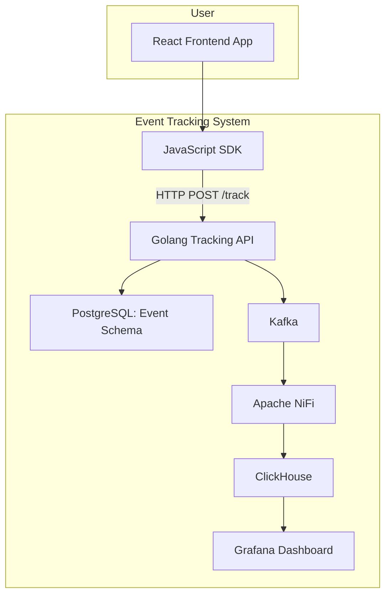
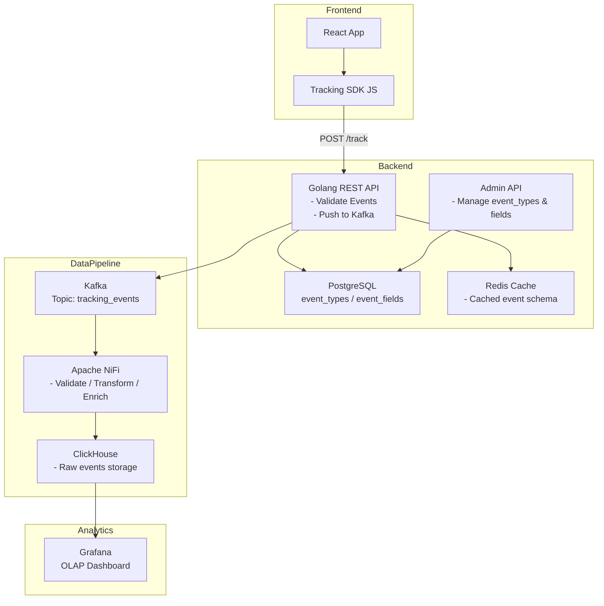
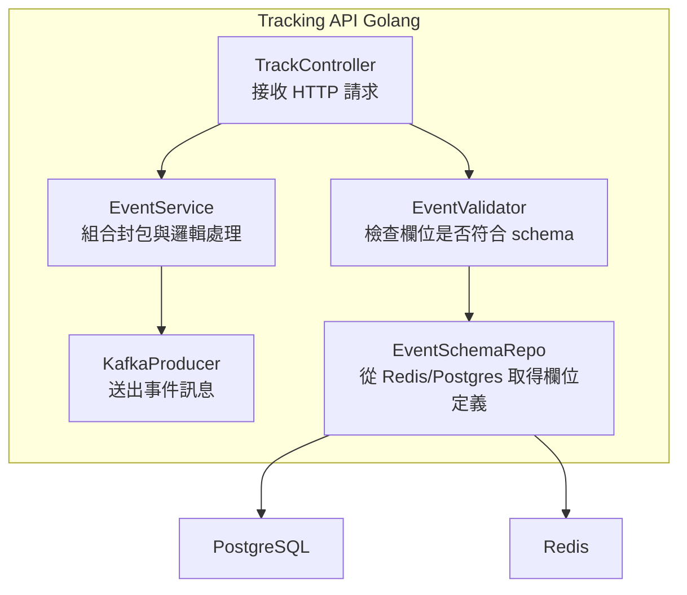
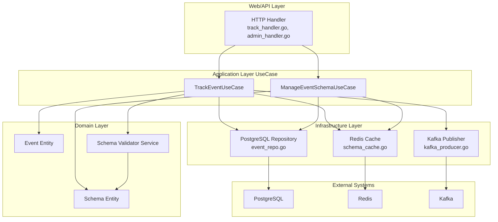
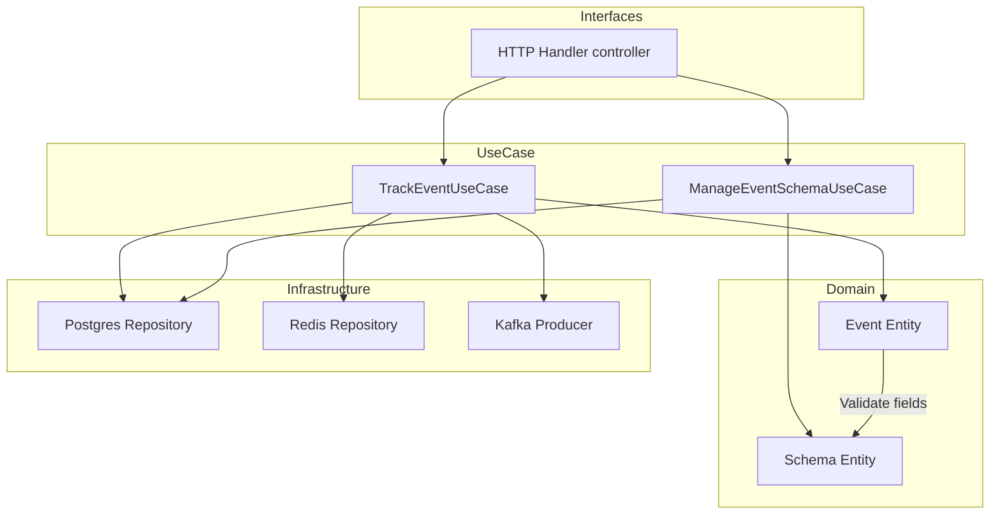

## Context Diagram（系統上下文圖）

---

## Container Diagram（系統容器圖）

---

## Component Diagram 系統組件圖

### Tracking API 組件

### Tracking API 架構

#### 📌 每個組件功能說明

| 組件                         | 描述                                                          |
| ---------------------------- | ------------------------------------------------------------- |
| **HTTP Handler**             | 提供 HTTP API 入口，驗證參數後呼叫 UseCase                    |
| **TrackEventUseCase**        | 處理前端送來的事件資料，套用 schema 驗證後發送到 Kafka 並紀錄 |
| **ManageEventSchemaUseCase** | 提供 UI 後台新增、修改、刪除事件 Schema 的功能                |
| **Event Entity**             | 描述使用者送出的追蹤事件物件                                  |
| **Schema Entity**            | 管理每種事件對應的欄位定義與驗證規則                          |
| **Schema Validator**         | 核對事件資料與對應 Schema 欄位的型別與約束                    |
| **PostgreSQL Repository**    | 儲存事件資料、schema 設定，提供 CRUD 功能                     |
| **Redis Cache**              | 快取 Schema 加速查詢（避免頻繁查資料庫）                      |
| **Kafka Producer**           | 將追蹤事件封裝後發送到 Kafka Topic，供下游處理                |

---

## Code Diagram 系統程式碼圖

