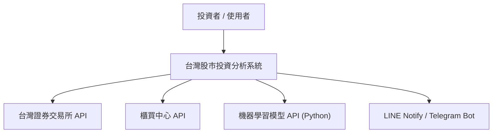
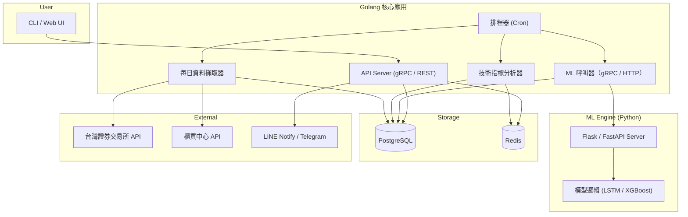
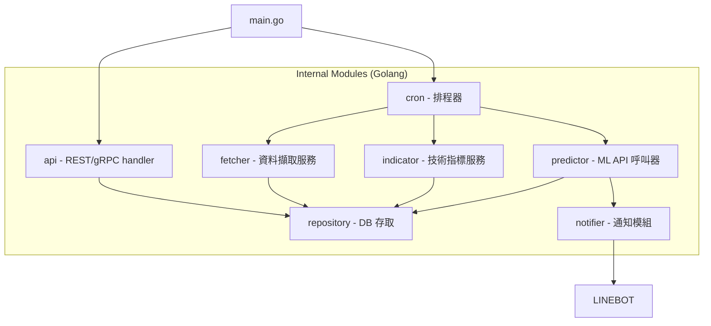
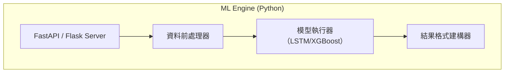

# 台灣股市投資工具系統設計文件

## 系統概述

本系統為台灣股市投資分析工具，專注於提供**交易預測服務**，透過技術指標分析與機器學習模型，為使用者產生買賣建議與信心指數。系統**不包含任何下單或交易執行功能**，亦不與任何證券交易平台直接連接，使用者需自行透過證券商平台完成交易。

系統整合台灣證券交易所及櫃買中心資料來源，並提供即時通知服務。架構設計採用 C4 模型，強調模組化、彈性擴展及安全性。

## 系統功能範圍

- **交易預測**：基於歷史股價與技術指標，運用機器學習模型進行買賣訊號預測。
- **資料擷取與分析**：每日自動擷取證交所與櫃買中心資料，計算技術指標。
- **通知推播**：將預測結果及重要訊息透過 LINE Notify / Telegram Bot 推送給使用者。
- **不提供下單功能**：系統不執行任何交易指令，避免交易風險與法規限制。

## C4 模型架構說明

### 1. Context Diagram（系統與外部互動）



### 2. Container Diagram（系統主要容器）



### 3. Component Diagram（組件細節）

#### Golang 核心應用



#### Python ML Engine



## 系統設計優化與落實

| 優化面向           | 具體實作與設計要點                                                                          |
| ------------------ | ------------------------------------------------------------------------------------------- |
| API 設計與版本控管 | 使用 OpenAPI/Swagger 定義 API，路徑包含版本號（如 `/v1/predict`），明確錯誤碼與回應格式。   |
| 通訊協議與效能     | 優先採用 gRPC 替代 REST，提升通訊效能與型別安全。                                           |
| 容器化與彈性部署   | ML Engine 採用 Docker 容器化，結合 Kubernetes 實現彈性擴展與資源調度。                      |
| 監控與健康檢查     | ML Engine 實作 `/health`、`/ready` 端點；整合集中式日誌與分散式追蹤（ELK、OpenTelemetry）。 |
| 安全性強化         | API 加入認證機制（JWT/API Key），全通訊使用 HTTPS 加密，保障資料安全。                      |
| 容錯與效能優化     | Golang 層實作重試與降級策略，避免 ML Engine 暫時失效影響整體系統；對重複推論結果使用快取。  |
| 文件與測試         | 建立單元測試、整合測試及 Mock Server，維護完整技術文件與架構圖。                            |
| CI/CD 與資源監控   | 導入自動化建置、測試與部署流程；監控 ML Engine CPU、記憶體使用狀況，預防瓶頸。              |

## Python ML Engine API 規範範例

**請求範例**

```http
POST /v1/predict
Content-Type: application/json
Authorization: Bearer

{
  "stock_id": "2330",
  "model_type": "LSTM",
  "features": {
    "macd": [...],
    "rsi": [...],
    "kdj": [...]
  }
}
```

**回應範例**

```json
{
  "stock_id": "2330",
  "prediction": "BUY",
  "confidence": 0.83,
  "model_type": "LSTM"
}
```

## 結語

本系統設計文件完整呈現台灣股市投資工具系統之架構與資料庫設計，明確界定系統功能範圍為**交易預測服務**，不涉及交易執行。設計融合系統優化建議，確保系統具備高效、穩定與安全的運行能力。後續可依需求持續擴充與調整，打造符合投資者需求的智慧分析平台。
