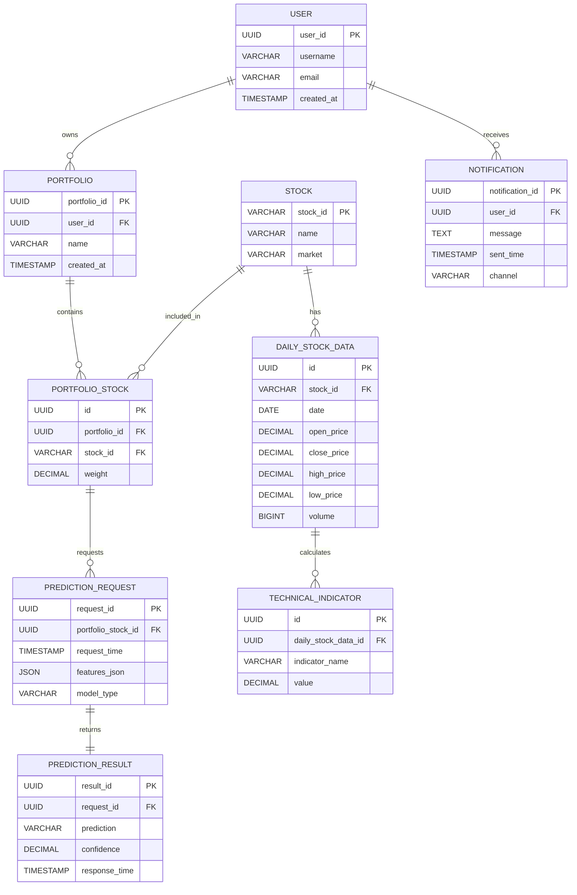

## 資料庫設計

### ER Diagram (Mermaid 表示)



### PostgreSQL Table Schema

```sql
CREATE TABLE users (
    user_id UUID PRIMARY KEY DEFAULT gen_random_uuid(),
    username VARCHAR(50) UNIQUE NOT NULL,
    email VARCHAR(100),
    created_at TIMESTAMP NOT NULL DEFAULT CURRENT_TIMESTAMP
);
COMMENT ON TABLE users IS '使用者資料表，記錄投資者帳號資訊';
COMMENT ON COLUMN users.user_id IS '使用者唯一識別碼';
COMMENT ON COLUMN users.username IS '使用者帳號';
COMMENT ON COLUMN users.email IS '使用者電子郵件';
COMMENT ON COLUMN users.created_at IS '帳號建立時間';

CREATE TABLE portfolios (
    portfolio_id UUID PRIMARY KEY DEFAULT gen_random_uuid(),
    user_id UUID NOT NULL REFERENCES users(user_id),
    name VARCHAR(100) NOT NULL,
    created_at TIMESTAMP NOT NULL DEFAULT CURRENT_TIMESTAMP
);
COMMENT ON TABLE portfolios IS '投資組合資料表，使用者可建立多個投資組合';
COMMENT ON COLUMN portfolios.portfolio_id IS '投資組合唯一識別碼';
COMMENT ON COLUMN portfolios.user_id IS '所屬使用者ID';
COMMENT ON COLUMN portfolios.name IS '投資組合名稱';
COMMENT ON COLUMN portfolios.created_at IS '投資組合建立時間';

CREATE TABLE stocks (
    stock_id VARCHAR(10) PRIMARY KEY,
    name VARCHAR(100) NOT NULL,
    market VARCHAR(20) NOT NULL
);
COMMENT ON TABLE stocks IS '股票基本資料表';
COMMENT ON COLUMN stocks.stock_id IS '股票代號';
COMMENT ON COLUMN stocks.name IS '股票名稱';
COMMENT ON COLUMN stocks.market IS '股票所屬市場，如 TWSE、TPEX';

CREATE TABLE portfolio_stocks (
    id UUID PRIMARY KEY DEFAULT gen_random_uuid(),
    portfolio_id UUID NOT NULL REFERENCES portfolios(portfolio_id),
    stock_id VARCHAR(10) NOT NULL REFERENCES stocks(stock_id),
    weight DECIMAL(5,4) NOT NULL CHECK (weight >= 0 AND weight <= 1)
);
COMMENT ON TABLE portfolio_stocks IS '投資組合持股表，記錄投資組合中包含的股票及持股比例';
COMMENT ON COLUMN portfolio_stocks.id IS '主鍵識別碼';
COMMENT ON COLUMN portfolio_stocks.portfolio_id IS '所屬投資組合ID';
COMMENT ON COLUMN portfolio_stocks.stock_id IS '股票代號';
COMMENT ON COLUMN portfolio_stocks.weight IS '持股比例，範圍0~1';

CREATE TABLE daily_stock_data (
    id UUID PRIMARY KEY DEFAULT gen_random_uuid(),
    stock_id VARCHAR(10) NOT NULL REFERENCES stocks(stock_id),
    date DATE NOT NULL,
    open_price DECIMAL(10,2),
    close_price DECIMAL(10,2),
    high_price DECIMAL(10,2),
    low_price DECIMAL(10,2),
    volume BIGINT,
    UNIQUE(stock_id, date)
);
COMMENT ON TABLE daily_stock_data IS '每日股價資料表，記錄個股每日交易資訊';
COMMENT ON COLUMN daily_stock_data.id IS '主鍵識別碼';
COMMENT ON COLUMN daily_stock_data.stock_id IS '股票代號';
COMMENT ON COLUMN daily_stock_data.date IS '交易日期';
COMMENT ON COLUMN daily_stock_data.open_price IS '開盤價';
COMMENT ON COLUMN daily_stock_data.close_price IS '收盤價';
COMMENT ON COLUMN daily_stock_data.high_price IS '最高價';
COMMENT ON COLUMN daily_stock_data.low_price IS '最低價';
COMMENT ON COLUMN daily_stock_data.volume IS '成交量';

CREATE TABLE technical_indicators (
    id UUID PRIMARY KEY DEFAULT gen_random_uuid(),
    daily_stock_data_id UUID NOT NULL REFERENCES daily_stock_data(id),
    indicator_name VARCHAR(50) NOT NULL,
    value DECIMAL(10,4) NOT NULL
);
COMMENT ON TABLE technical_indicators IS '技術指標資料表，記錄每日股價相關技術指標';
COMMENT ON COLUMN technical_indicators.id IS '主鍵識別碼';
COMMENT ON COLUMN technical_indicators.daily_stock_data_id IS '對應每日股價資料ID';
COMMENT ON COLUMN technical_indicators.indicator_name IS '指標名稱，如 MACD、RSI、KDJ';
COMMENT ON COLUMN technical_indicators.value IS '指標數值';

CREATE TABLE prediction_requests (
    request_id UUID PRIMARY KEY DEFAULT gen_random_uuid(),
    portfolio_stock_id UUID NOT NULL REFERENCES portfolio_stocks(id),
    request_time TIMESTAMP NOT NULL DEFAULT CURRENT_TIMESTAMP,
    features_json JSON NOT NULL,
    model_type VARCHAR(50) NOT NULL
);
COMMENT ON TABLE prediction_requests IS '機器學習推論請求記錄表';
COMMENT ON COLUMN prediction_requests.request_id IS '推論請求唯一識別碼';
COMMENT ON COLUMN prediction_requests.portfolio_stock_id IS '對應投資組合持股ID';
COMMENT ON COLUMN prediction_requests.request_time IS '請求時間';
COMMENT ON COLUMN prediction_requests.features_json IS '輸入特徵資料(JSON格式)';
COMMENT ON COLUMN prediction_requests.model_type IS '使用的模型類型';

CREATE TABLE prediction_results (
    result_id UUID PRIMARY KEY DEFAULT gen_random_uuid(),
    request_id UUID NOT NULL UNIQUE REFERENCES prediction_requests(request_id),
    prediction VARCHAR(20) NOT NULL,
    confidence DECIMAL(5,4) NOT NULL,
    response_time TIMESTAMP NOT NULL DEFAULT CURRENT_TIMESTAMP
);
COMMENT ON TABLE prediction_results IS '機器學習推論結果表';
COMMENT ON COLUMN prediction_results.result_id IS '推論結果唯一識別碼';
COMMENT ON COLUMN prediction_results.request_id IS '對應推論請求ID';
COMMENT ON COLUMN prediction_results.prediction IS '預測結果，如 BUY、SELL、HOLD';
COMMENT ON COLUMN prediction_results.confidence IS '預測信心指數';
COMMENT ON COLUMN prediction_results.response_time IS '回應時間';

CREATE TABLE notifications (
    notification_id UUID PRIMARY KEY DEFAULT gen_random_uuid(),
    user_id UUID NOT NULL REFERENCES users(user_id),
    message TEXT NOT NULL,
    sent_time TIMESTAMP NOT NULL DEFAULT CURRENT_TIMESTAMP,
    channel VARCHAR(20) NOT NULL
);
COMMENT ON TABLE notifications IS '通知紀錄表，記錄系統發送給使用者的通知';
COMMENT ON COLUMN notifications.notification_id IS '通知唯一識別碼';
COMMENT ON COLUMN notifications.user_id IS '接收通知的使用者ID';
COMMENT ON COLUMN notifications.message IS '通知內容';
COMMENT ON COLUMN notifications.sent_time IS '通知發送時間';
COMMENT ON COLUMN notifications.channel IS '通知渠道，如 LINE、Telegram';
```
